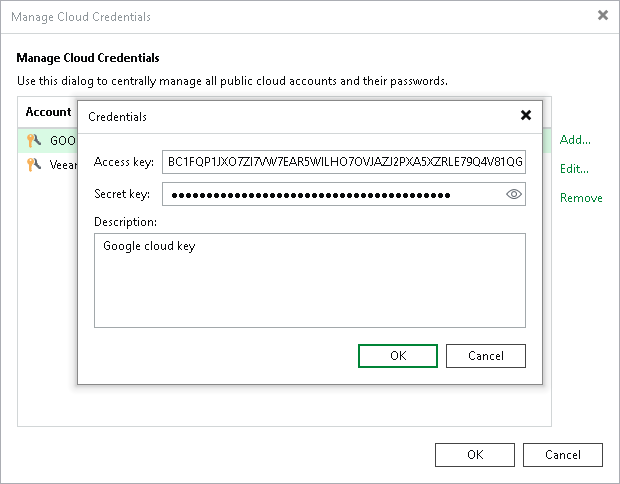

# Google Cloud Accounts

In this article

You can add to the backup infrastructure a credentials record for the Google Cloud account that will be used to connect to Google Cloud Storage. Veeam Backup & Replication uses these credentials to add a Google Cloud storage repository to the backup infrastructure as an [external repository](external_repository.md).

To create a record for a Google Cloud account:

1. From the main menu, select Credentials and Passwords > Cloud Credentials.
2. Click Add > Google Cloud access key.
3. In the Access Key and Secret key fields, specify the Hash-based Message Authentication Code (HMAC) key associated with the Google Cloud account. Veeam Backup & Replication will use the HMAC key to authenticate requests to the Google Cloud Storage. To view the entered key, click and hold the eye icon on the right of the field. For more information on Google Cloud accounts, see the [Google Cloud documentation](https://cloud.google.com/iam/docs/creating-managing-service-accounts#creating_a_service_account).

If you use Veeam Backup & Replication for Microsoft Windows and you have not created the HMAC key beforehand, you can do one of the following:

* Create the HMAC key in the Google Cloud console, as described in the [Google Cloud documentation](https://cloud.google.com/storage/docs/authentication/managing-hmackeys#console_1).
* Create the HMAC key in the Veeam Backup for Google Cloud Web UI, as described in the [Veeam Backup for Google Cloud User Guide](https://helpcenter.veeam.com/docs/vbgc/guide/repository_project.html?ver=7).

If you use Veeam Backup & Replication for Linux and you have not created the HMAC key beforehand, you can create the HMAC key in the Google Cloud console, as described in the [Google Cloud documentation](https://cloud.google.com/storage/docs/authentication/managing-hmackeys#console_1).

1. In the Description field, enter an optional description for the credentials record.

cloud

Related Topics

[External Repository](external_repository.md)

Page updated 11/19/2025

Page content applies to build 13.0.1.1071
