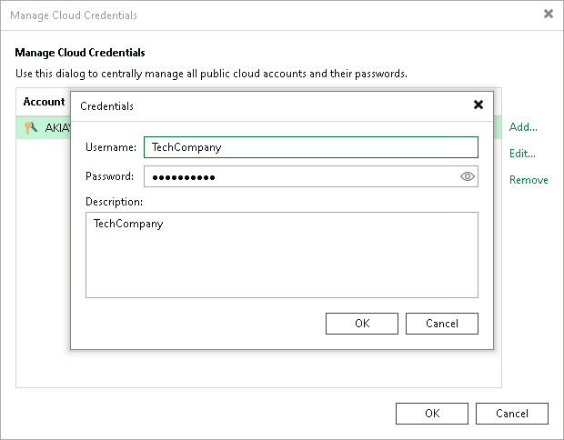

# Veeam Cloud Connect Accounts

In this article

You can add a credentials record for a tenant account — an account that you plan to use to connect to a service provider (SP).

Before you add a credentials record, the SP must register a tenant account on the SP Veeam backup server. Tenants without accounts cannot connect to the SP and use Veeam Cloud Connect resources. For more information, see the [Registering Tenant Accounts](https://helpcenter.veeam.com/docs/vbr/cloud/cloud_connect_tenant.html?ver=13) section in the Veeam Cloud Connect Guide.

To create a credentials record for a tenant account:

1. From the main menu, select Credentials and Passwords > Cloud Credentials.
2. Click Add > Veeam Cloud Connect service provider account.
3. In the Username field, enter a user name for the account that the SP has provided to you.

|  |
| --- |
| Note |
| If the SP used VMware Cloud Director to allocate replication resources to you, you must enter a user name for the VMware Cloud Director tenant account in the following format: Organization\Username. For example: TechCompanyOrg\Administrator. |

1. In the Password field, enter a password for the account that the SP has provided to you. To view the entered password, click and hold the eye icon on the right of the field.
2. In the Description field, enter a description for the created credentials record.

Page updated 6/12/2024

Page content applies to build 13.0.1.1071
