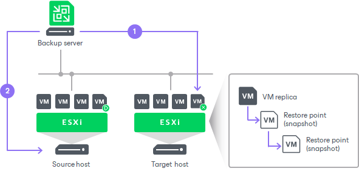

# Failback Commit

Failback commit is one of the ways to finalize failback. When you commit failback, you confirm that the VM to which you failed back (the production VM) and also changes sent to it during failback work as expected. After the commit operation, Veeam Backup & Replication resumes replication activities for the production VM.

|  |
| --- |
| Note |
| If you have selected to [switch to the production VM manually](failback_switch_schedule.md), you must first perform the [switchover](failback_switch_to_prod.md). |

The failback commit operation is performed in the following way:

1. Veeam Backup & Replication changes the state of the replica from Failback to Ready.
2. Further operations depend on whether you have failed back to the source VM or recovered VM:

* If you have failed back to a VM recovered from a backup or replica, Veeam Backup & Replication reconfigures all existing jobs where the source VM is present and adds the source VM to the list of exclusions. The recovered VM takes the role of the source VM and is included into all jobs instead of the excluded VM. When the replication job starts, Veeam Backup & Replication processes the recovered VM instead of the former source VM.
* If you have failed back to the source VM, the replication job is not reconfigured. When the replication job starts, Veeam Backup & Replication still processes the source VM.

During failback commit, the failback protective snapshot that saves the pre-failback state of a VM replica is not deleted. Veeam Backup & Replication uses this snapshot as an additional restore point for VM replica. With the pre-failback snapshot, Veeam Backup & Replication needs to transfer fewer changes and therefore puts less load on the network when replication activities are resumed.

Related Topics

[Committing Failback](failback_commit.md)

