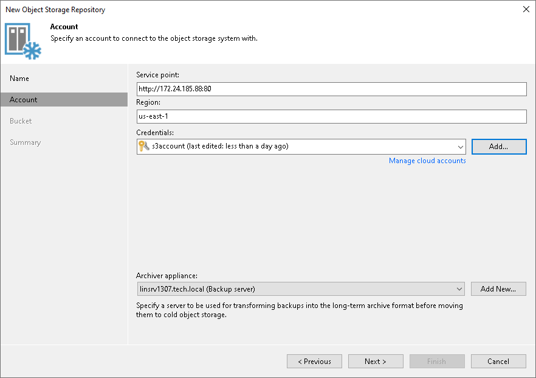

# Step 3. Specify Object Storage Account

In this article

At the Account step of the wizard, specify the connection and archiver appliance settings. An archiver appliance is an auxiliary machine that transfers data from S3 compatible object storage to S3 compatible object storage with data archive. For more information, see the [Archiver Appliances](archiver_appliance.md) section.

1. In the Service point field, specify an endpoint address and a port number of your S3 compatible object storage with data archive.
2. In the Region field, specify a region.
3. From the Credentials drop-down list, select user credentials to access your S3 compatible object storage with data archive.

If you already have a credentials record that was configured in advance, select it from the drop-down list. Otherwise, click Add and provide your access and secret keys, as described in [Access Keys for AWS Users](cloud_credentials_aws.md). You can also click the Manage cloud accounts link to add, edit or remove a credentials record.

1. From the Archiver appliance drop-down list, select the archiver appliance. Click Add New to add a new archiver appliance to your backup infrastructure. For information on how to add a server, see [Adding Microsoft Windows Servers](add_windows_server.md) and [Adding Linux Servers](add_linux_server.md).

Page updated 8/8/2025

Page content applies to build 13.0.1.1071
