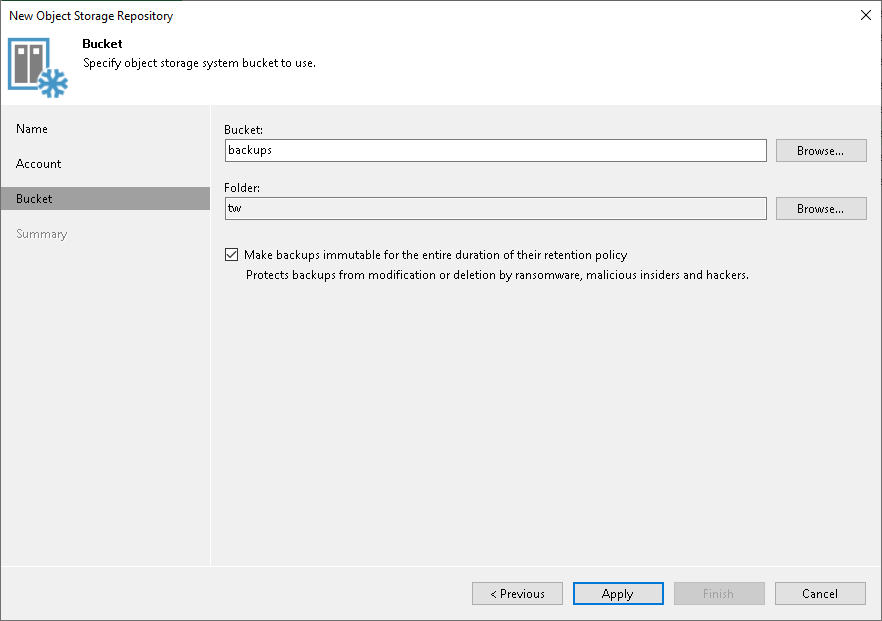

# Step 4. Specify Object Storage Settings

In this article

At the Bucket step of the wizard, specify the bucket and folder where you will store data, and define storage limits and immutability settings that Veeam Backup & Replication will apply to data in the object storage.

1. In the Bucket field, enter a name of the bucket or click Browse to get the necessary bucket.

Note that you must create the bucket where you want to store your backup data beforehand.

1. In the Folder field, enter a cloud folder name to which you want to map your S3 compatible object storage with data archive. Alternatively, click Browse and either select an existing folder or click New Folder.
2. To prohibit deletion of blocks of data from object storage, select the Make recent backups immutable (recommended) check box. Keep in mind that to use immutability, you must enable the Object Lock and Versioning features on your S3 bucket at the time when you create the bucket. For more information, see [Enabling Immutability](immutability_os_enable.md). In the Immutability Settings window, specify how the immutability period is counted and set the immutability period in days:

* Select For the entire duration of their retention policy if you want the immutability period depend on the retention policy of a backup job.

|  |
| --- |
| Important |
| Consider the following:   * If the job retention exceeds the immutability period, the actual retention is counted as job retention policy + Block Generation period. * If the immutability period exceeds the job retention period, the actual retention is counted as immutability period + Block Generation period.   For more information, see [How Immutability Works](hiw_immutability_os.md), |

* Select For the minimum immutability period only if you want to specify the immutability period explicitly. The backup job retention will be skipped.
* Next to the Minimum immutability duration option, provide the necessary value.

Page updated 8/8/2025

Page content applies to build 13.0.1.1071
