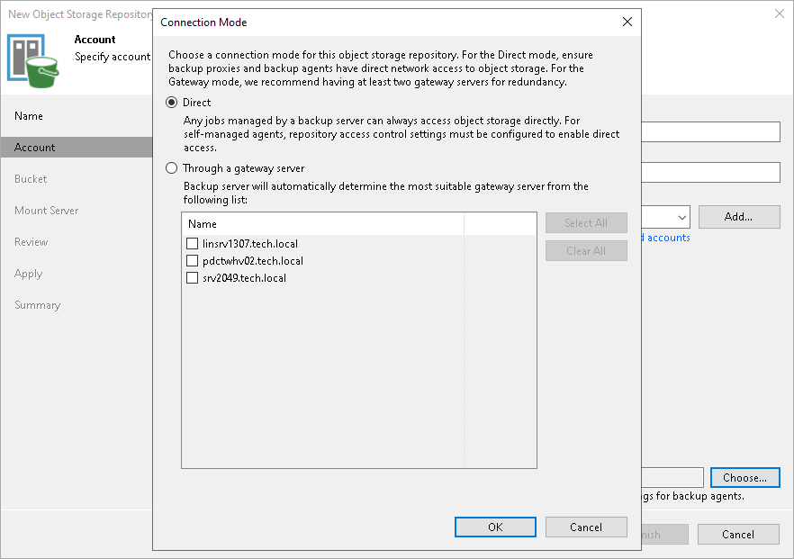

# Step 3. Specify Object Storage Account

At the Account step of the wizard, specify the connection settings:

1. In the Service point field, specify an endpoint address and a port number of your S3 compatible object storage.
2. In the Region field, specify a region.
3. From the Credentials drop-down list, select user credentials to access your S3 compatible object storage.

If you already have a credentials record that was configured in advance, select it from the drop-down list. Otherwise, click Add and provide your access and secret keys, as described in section [Access Keys for AWS Users](cloud_credentials_aws.md). You can also click the Manage cloud accounts link to add, edit or remove a credentials record.

1. Next to the Connection mode field, click Choose and specify how Veeam Backup & Replication will transfer data to the object storage repository:

* Direct — select this option if you want to instantly move data of processed VMs or file shares to object storage repositories. Before you select this option, check the following [Considerations and Limitations](object_storage_repository_cal.md#directmode).

* Through gateway server — select this option if you want Veeam Backup & Replication to use a gateway server to transfer data from processed VM or file share to object storage repositories. From the Name list, select gateway servers that you want to use for data transfer operations.

By default, the role of a gateway server is assigned to the Veeam Backup & Replication server. You can choose any Microsoft Windows or Linux server that is added to your Veeam Backup & Replication infrastructure and has internet connection. Note that you must add the server to the Veeam Backup & Replication infrastructure beforehand. Before you add the server, check the following [Considerations and Limitations](object_storage_repository_cal.md). For more information on how to add a server, see [Virtualization Servers and Hosts](setup_add_server.md).

|  |
| --- |
| Note |
| By default, if Veeam Agent stores data in S3 compatible objects storage repositories, it transfers data using a gateway server. If you want Veeam Agent to access repositories directly or using specific credentials, you must specify the [Access Permissions](access_permissions.md#s3compatible) settings. |

