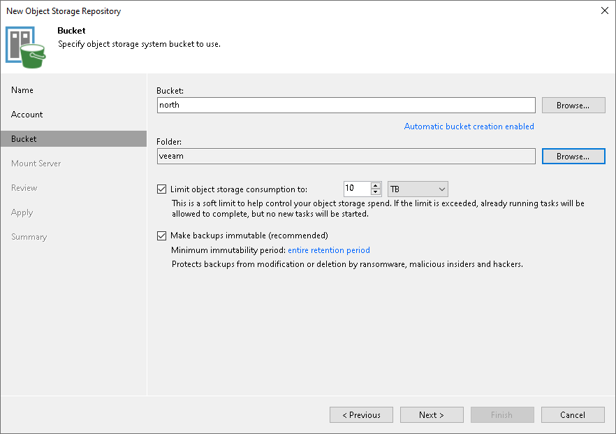
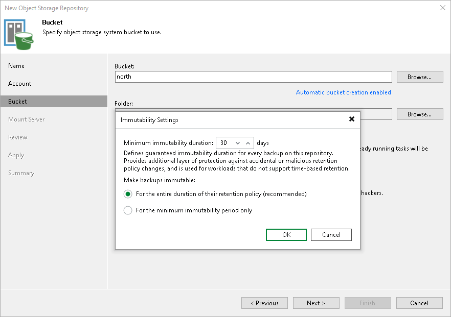

# Step 4. Specify Object Storage Settings

In this article

At the Bucket step of the wizard, specify the bucket and folder where you will store data, and define storage limits and immutability settings that Veeam Backup & Replication will apply to data in the object storage.

1. In the Bucket field, enter a name of the bucket or click Browse to get the necessary bucket.

Note that you must create the bucket where you want to store your backup data beforehand.

1. To create [multiple child buckets](object_storage_repository.md#childbuckets) automatically, do the following:

1. Click the Automatic bucket creation disabled link.
2. To specify a number of per-machine backups chains that you want to keep in a single child bucket, check the Create new buckets automatically check box. Veeam Backup & Replication will create child buckets according to this amount of backup chains.

1. To the right of the Folder field, click Browse and either select an existing folder or click New Folder.

1. Select the Limit object storage consumption to check box to define a soft limit for your object storage consumption. If this limit is exceeded during a job run, Veeam Backup & Replication will complete the job. However, a new job will not be able to start unless you remove the extra data that exceeds the limit or change the soft limit settings. Provide the value in TB or PB.

Specifying Immutability Settings

To prohibit deletion of blocks of data from object storage, select the Make recent backups immutable (recommended) check box. In the Immutability Settings window, specify how the immutability period is counted and set the immutability period in days:

* Select For the entire duration of their retention policy if you want the immutability period depend on the retention policy of a backup job.

|  |
| --- |
| Important |
| Consider the following:   * If the job retention exceeds the immutability period, the actual retention is counted as job retention policy + Block Generation period. * If the immutability period exceeds the job retention period, the actual retention is counted as immutability period + Block Generation period.   For more information, see [How Immutability Works](hiw_immutability_os.md), |

* Select For the minimum immutability period only if you want to specify the immutability period explicitly. The backup job retention will be skipped.
* Next to the Minimum immutability duration option, provide the necessary value.

Note that the maximum immutability period you can set in the Veeam Backup & Replication UI is 999 days. If you want to set immutability to a longer period, use the [Set-VBRAmazonS3CompatibleRepository](https://helpcenter.veeam.com/docs/vbr/powershell/set-vbramazons3compatiblerepository.html?ver=13) cmdlet.

Page updated 11/21/2025

Page content applies to build 13.0.1.1071
