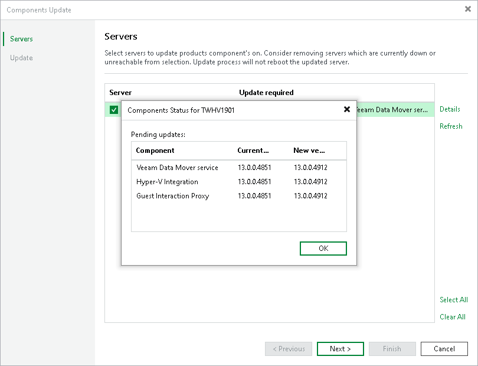
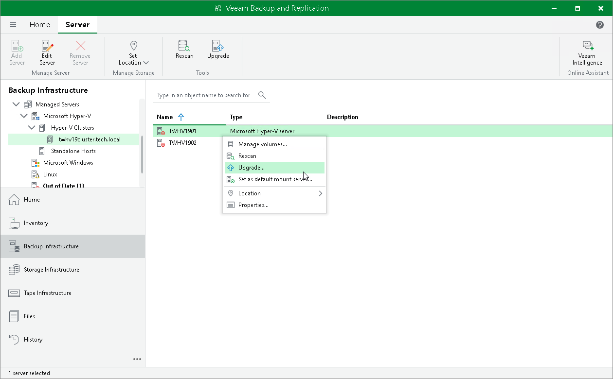

# Updating Infrastructure Components

In this article

Every time you launch the Veeam Backup & Replication console, Veeam Backup & Replication automatically checks if Veeam Backup & Replication components installed on managed servers are up to date. If a later version of components is available, the system displays the Components Update window once a week for all users (once per user) who access the backup server. Components upgrade may be necessary, for example, after you have upgraded Veeam Backup & Replication.

You can manually check if components upgrade is required. To do this, select Upgrade from the main menu. If components on all managed servers are up to date, the menu item will be disabled.

Bulk Upgrade

To upgrade components on managed servers:

1. In the Components Update window, select a server and click Details. Veeam Backup & Replication will display the current and latest available versions for installed components.
2. In the Components Update window, select check boxes next to servers for which you want to upgrade components and click Apply.

Individual Upgrade

You can update components on every managed server separately. If components installed on the server require upgrade, Veeam Backup & Replication displays a warning icon next to the server.

To update components for an individual managed server:

1. Open the Backup Infrastructure view.
2. In the [inventory pane](vbr_ui.md), click Managed servers.
3. In the working area, select the server and click Upgrade on the ribbon. Alternatively, right-click the selected server and select Upgrade.

Page updated 8/8/2025

Page content applies to build 13.0.1.1071
