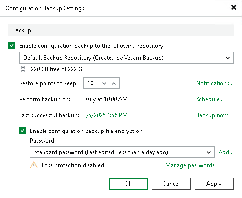

# Creating Encrypted Configuration Backups

You must encrypt configuration backups in the following cases:

* If you have created at least one password in the Password Manager on the backup server. In this case, Veeam Backup & Replication will not start configuration backup job until you enable encryption.

It is strongly recommended to encrypt configuration backups even if you have not created any passwords.

* If you use Veeam Software Appliance with the enabled Security Officer account. During the [initial login](hmc_users_security_officer.md), a Security Officer creates a passphrase used to provide double data encryption and protect sensitive data against malicious users who may have access to configuration backups and associated passwords. In this case, the protection mechanism will work properly only if you enable encryption. Otherwise, a configuration backup job will fail.

If the configuration backup is unencrypted, data from it can be restored to any backup server without specifying an encryption password. Credentials, encryption keys, and certificates will not be stored in the configuration backup. The content of encrypted files and access to the backup infrastructure will become unavailable after the configuration restore. Additionally, sensitive information such as machine or server IP addresses may be exposed to unintended audiences.

How Encryption Works

To encrypt configuration backup files, Veeam Backup & Replication uses specific data encryption keys. These keys are encrypted with the secret key based on the password. For more information on data encryption keys, see [How Backup Data Encryption Works](encryption_hiw.md).

The encryption process for a configuration backup job includes the following steps:

1. When you enable the encryption option, you need to enter a password. For more information, see [Enabling Encription for Configuration Backups](#enable_encryption).
2. Veeam Backup & Replication generates a secret key based on the password.
3. When a configuration backup job starts, Veeam Backup & Replication does the following:

1. Decrypts data encrypted with built-in operating system mechanisms for data protection. For more information, see [How Database Data Encryption Works](encryption_database_hiw.md).
2. Encrypts data with data encryption keys.
3. Passes encrypted data to the target backup repository.
4. Stores data to a resulting BCO file.

Besides encryption keys, the created backups capture credential records specified in the Credentials Manager. When you restore data from such a backup, you will not have to enter passwords for credentials records again (unless the passwords for credentials records have changed by the time of restore).

|  |
| --- |
| Important |
| Configuration backup jobs do not support data encryption with KMS keys. |

Enabling Encryption for Configuration Backups

To enable encryption for a configuration backup, do the following:

1. From the main menu, select Configuration Backup.
2. Select the Enable configuration backup file encryption check box.
3. From the Password field, select a password you want to use for encryption. If you have not created the password beforehand, click Add or use the Manage passwords link to specify a new password. For more information, see [Password Manager](password_manager.md).

If you do not use password loss protection, Veeam Backup & Replication will display a warning. For more information, see [Password Loss Protection](encryption_password_loss_protection.md).

|  |
| --- |
| Note |
| If you enable encryption and use cloud plug-ins to protect VMs in Google Cloud, AWS and other environments, Veeam Backup & Replication will also create backups for cloud backup appliances. For more information on appliance configuration backup and restore, see the following guides:   * Veeam Backup for Google Cloud, the [Performing Configuration Backup and Restore](https://helpcenter.veeam.com/docs/vbgc/guide/performing_configuration_backup_restore.html?ver=7) section. * Veeam Backup for AWS, the [Performing Configuration Backup and Restore](https://helpcenter.veeam.com/docs/vbaws/guide/config_backup.html?ver=10) section.  * Veeam Backup for Microsoft Azure, the [Performing Configuration Backup and Restore](https://helpcenter.veeam.com/docs/vbazure/guide/configuration_backup_and_restore.html?ver=8.1) section. |

