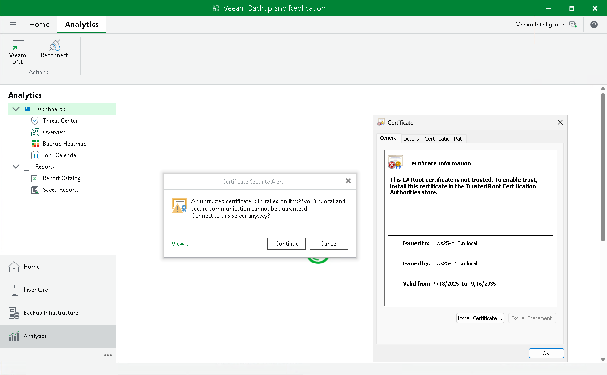
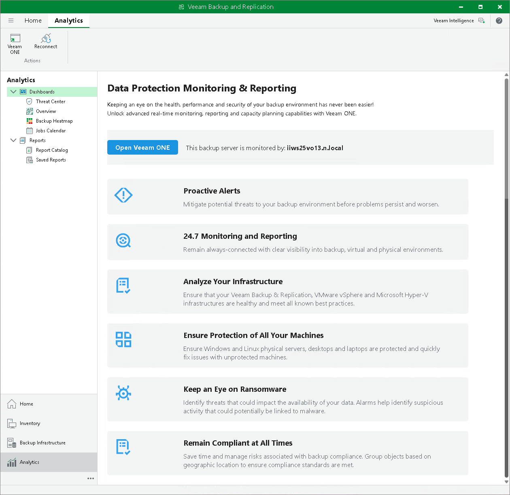

# Configuring Analytics View

|  |
| --- |
| Note |
| Consider the following:   * For Windows-based Veeam Backup & Replication console, the Analytics view is available if you have the Microsoft Edge WebView2 Runtime component installed. * If Veeam ONE lacks the license required for the integration with Veeam Backup & Replication, you will see a placeholder with the license information in the Analytics view. For more information, see the [Licensing Veeam ONE](https://helpcenter.veeam.com/docs/one/userguide/licensing.html?ver=13) section in the Veeam ONE User Guide. |

The Analytics view is designed to provide easy access to dashboards and reports configured in Veeam ONE for monitoring the backup infrastructure and data protection operations in the virtual environment.

The Dashboards section of the Analytics view displays and allows updating parameters for the following Veeam ONE dashboards:

* [Veeam Threat Center](https://helpcenter.veeam.com/docs/one/userguide/data_protection_platform.html?ver=13)
* [Veeam Backup & Replication Overview](https://helpcenter.veeam.com/docs/one/userguide/vbr_dashboard.html?ver=13)
* [Backup Heatmap](https://helpcenter.veeam.com/docs/one/userguide/heatmap_dashboard.html?ver=13)
* [Jobs Calendar](https://helpcenter.veeam.com/docs/one/userguide/job_calendar.html?ver=13)

The Reports section of the Analytics view allows generating, viewing, and managing both predefined and custom reports available in Veeam ONE. Use this section to access detailed insights into your backup infrastructure, configuration, compliance, and operational trends.

Reports cover a wide range of topics, including backup inventory, repository usage, security compliance, capacity planning, change tracking, and more. You can select from the available report templates or run custom reports tailored to your environment’s needs.

For a detailed description of reports and their capabilities, see the [Veeam ONE User Guide](https://helpcenter.veeam.com/docs/one/userguide/reports.html?ver=13).

Enabling Analytics Feature

To enable the Analytics feature, do the following:

1. Add your Veeam Backup & Replication server to the Veeam ONE infrastructure, as described in the [Veeam ONE User Guide](https://helpcenter.veeam.com/docs/one/userguide/backup_server_connect.html?ver=13). Do not forget to select the Allow Veeam Backup & Replication to display analytics data check box.
2. Wait till Veeam ONE collects the required analytical data. After that, the Veeam ONE dashboards and reports can be opened in Veeam Backup & Replication.
3. When opening any node in the Analytics view for the first time, Veeam Backup & Replication will prompt you to install the certificate issued by the server where Veeam ONE is installed.

In the Certificate Security Alert dialog box, click Continue to install it. Alternatively, you can click View to view certificate details; after that, click Install Certificate and in the Certificate Import Wizard, configure how Veeam Backup & Replication will store certificates.

Now, you can use the Analytics view to view Veeam ONE dashboards and run Veeam ONE reports for the current backup server.

If you move a Veeam Backup & Replication server to a different Veeam ONE instance and delete it from the current instance, the Veeam Backup & Replication servers become unregistered for all integrations. To solve this, clear the Allow Veeam Backup & Replication to display analytics data check box in Connection Settings and select it in the new Veeam ONE instance. For details, see the [Changing Server Connection Settings](https://helpcenter.veeam.com/docs/one/userguide/change_server_connections.html?ver=13) section in the Veeam ONE Deployment Guide.

Switching to Veeam ONE Web Client

You can quickly switch to the Veeam ONE web client. To do that, click Veeam ONE in the ribbon. Alternatively, you can open the Dashboards or Reports node in the Analytics view and click Open Veeam ONE in the working area.

Reconnecting to Veeam ONE Instance

In case of any problems with the connection to the Veeam ONE instance, you can reconnect to it. To do that, click Reconnect in the ribbon.

