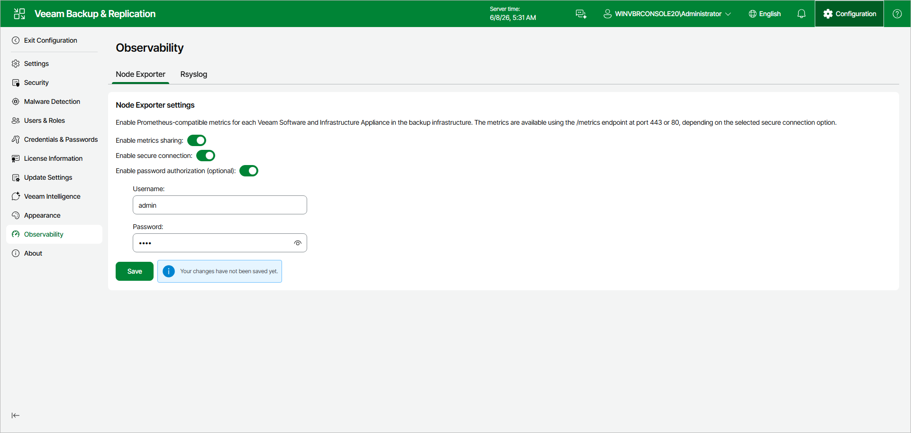

# Configuring Node Exporter

Node Exporter shares performance metrics from the Veeam Software Appliance and Veeam Infrastructure Appliances in the Prometheus format.

You can configure Node Exporter in the Veeam Backup & Replication web UI. Veeam Backup & Replication then distributes the settings to all Veeam Appliances in your backup infrastructure.

Node Exporter shares the following metrics:

* Default Node Exporter metrics, such as CPU, RAM, disk, and network consumption
* cpu\_vulnerabilities, ethtool, and mountstats
* XFS quota information
* iSCSI and Fibre Channel information
* Status of Veeam services

Enabling Metrics Sharing

To configure Node Exporter, do the following:

1. Click Configuration in the top bar.
2. In the management pane, click Observability > Node Exporter.
3. Set the Enable metrics sharing toggle to On.

1. Set the Enable secure connection toggle. If it is Off, metrics are shared over HTTP (port 80). If it is On, metrics are shared over HTTPS (port 443).
2. [Optional] Set the Enable password authorization toggle to On. Then, specify a user name and password to access the metrics data.

Once configured, a monitoring server can retrieve the metrics from https://%YourApplianceIP%/metrics or http://%YourApplianceIP%/metrics.

Page updated 2026-07-03

