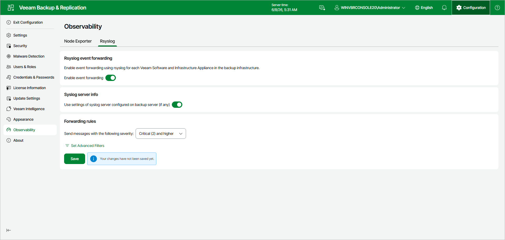

# Configuring Syslog

Syslog forwards system logs from the Veeam Software Appliance and Veeam Infrastructure Appliances to a remote syslog server. You can configure Syslog in the Veeam Backup & Replication web UI.

Veeam Backup & Replication then distributes the settings to all Veeam Appliances in your backup infrastructure.

You can forward logs to the syslog server that Veeam Backup & Replication already uses for event forwarding. You can also specify a separate server. Syslog uses the same transport protocols as Veeam Backup & Replication event forwarding.

Enabling Syslog Event Forwarding

To enable Syslog event forwarding:

1. Click Configuration in the top bar.
2. In the management pane, click Observability > Syslog.
3. Set the Enable event forwarding toggle to On.
4. Then, do one of the following:

* To use a syslog server that is already used for Veeam Backup & Replication event forwarding, set the Use settings of syslog server configured on backup server (if any) toggle to On.

* To configure a new syslog server:

1. Specify the server that you want to forward logs to. You can use IPv4, IPv6, or the DNS name of the server.

1. Specify the port for forwarding the logs.
2. Select a transport protocol.

|  |
| --- |
| Note |
| Audit logs can only be forwarded over TLS. Additionally, you must set the forwarded event severity level to Informational (6) and higher or Debug (7) and higher. |

|  |
| --- |
| Important |
| If you use TLS transport with a custom certificate, you must manually upload the certificate to all Veeam Software Appliance and Veeam Infrastructure Appliance hosts. |

1. In the Forwarding Rules section, select an event severity level. Only events with this severity or higher are forwarded.

|  |
| --- |
| Tip |
| Lower numbers indicate higher levels of severity. |

1. Click Save.

Configuring Advanced Filtering

After you enable Syslog event forwarding, you can stop specific programs and services from sending events to the syslog server. You can exclude a program completely, or forward only events of certain severity levels.

Adding Advanced Filter

To add a new event filtering rule, do the following:

1. Click Configuration in the top bar.
2. In the management pane, click Observability > Syslog.
3. In the Forwarding Rules section, click Set Advanced Filters.
4. Click Add.
5. Specify an application name.

|  |
| --- |
| Important |
| Application names are case-sensitive. |

1. Select the event severity levels you do not want to forward.
2. Click OK.

List of Application Names

|  |  |  |  |  |  |  |  |  |  |  |  |  |  |  |  |  |  |  |  |  |  |  |  |  |  |  |  |  |  |  |  |  |  |  |  |  |  |  |  |  |  |  |  |  |  |  |  |  |  |  |  |  |  |  |  |  |  |  |  |  |  |  |  |  |  |  |  |  |  |  |  |  |  |  |  |  |  |  |  |  |  |  |  |  |  |  |  |  |  |  |  |  |  |  |  |  |  |  |  |  |  |  |  |  |  |  |  |  |  |  |  |  |  |  |  |  |  |  |  |  |  |  |  |  |  |  |  |  |  |  |  |  |  |  |  |  |  |  |  |  |  |  |  |  |  |  |  |  |  |  |  |  |  |  |  |  |  |  |  |  |  |  |  |  |  |  |  |  |  |  |  |  |  |  |  |  |  |  |  |  |  |  |  |  |  |  |  |  |  |  |  |  |  |  |  |  |  |  |  |  |  |  |  |  |  |  |  |  |  |  |  |  |  |  |  |  |  |  |  |  |  |  |  |  |  |  |  |  |  |  |  |  |  |  |  |  |  |  |  |  |  |  |  |  |  |  |  |  |  |  |  |  |  |  |  |  |  |  |  |  |  |
| --- | --- | --- | --- | --- | --- | --- | --- | --- | --- | --- | --- | --- | --- | --- | --- | --- | --- | --- | --- | --- | --- | --- | --- | --- | --- | --- | --- | --- | --- | --- | --- | --- | --- | --- | --- | --- | --- | --- | --- | --- | --- | --- | --- | --- | --- | --- | --- | --- | --- | --- | --- | --- | --- | --- | --- | --- | --- | --- | --- | --- | --- | --- | --- | --- | --- | --- | --- | --- | --- | --- | --- | --- | --- | --- | --- | --- | --- | --- | --- | --- | --- | --- | --- | --- | --- | --- | --- | --- | --- | --- | --- | --- | --- | --- | --- | --- | --- | --- | --- | --- | --- | --- | --- | --- | --- | --- | --- | --- | --- | --- | --- | --- | --- | --- | --- | --- | --- | --- | --- | --- | --- | --- | --- | --- | --- | --- | --- | --- | --- | --- | --- | --- | --- | --- | --- | --- | --- | --- | --- | --- | --- | --- | --- | --- | --- | --- | --- | --- | --- | --- | --- | --- | --- | --- | --- | --- | --- | --- | --- | --- | --- | --- | --- | --- | --- | --- | --- | --- | --- | --- | --- | --- | --- | --- | --- | --- | --- | --- | --- | --- | --- | --- | --- | --- | --- | --- | --- | --- | --- | --- | --- | --- | --- | --- | --- | --- | --- | --- | --- | --- | --- | --- | --- | --- | --- | --- | --- | --- | --- | --- | --- | --- | --- | --- | --- | --- | --- | --- | --- | --- | --- | --- | --- | --- | --- | --- | --- | --- | --- | --- | --- | --- | --- | --- | --- | --- | --- | --- | --- | --- | --- | --- | --- | --- | --- | --- | --- | --- | --- | --- | --- | --- | --- | --- | --- | --- | --- | --- | --- | --- | --- |
| Adding Advanced Filter  | Application Name | Description | Notes | | veeamhostmanager | Host Manager management events | — | | nginx | Web UI and management reverse proxy | — | | prometheus-node-exporter | Node Exporter system metrics | — | | dotnet | Shared identifier for the .NET services and identity security events | — | | VeeamBackupSvc | Veeam Management Pack events — monitoring and event-log records for the veeambackupsvc service | — | | VeeamRestApiSvc | REST and identity security events for the veeamrestapisvc service | — | | GatewayApiSvc | REST and identity security events for the veeamwebsvc service | — | | DataAnalyzerSvc | Veeam Management Pack events — monitoring and event-log records for the veeamdataanalyzersvc service | — | | VeeamManager | Veeam Management Pack events — monitoring and event-log records for Veeam.Backup.Manager, and general job-session information | — | | Veeam | Core backup service | — | | Veeam.StandBy.Service | Explorer and instant-recovery service | — | | Veeam.AHV.Service | Nutanix AHV hypervisor plug-in | — | | Veeam.KVM.Service | KVM hypervisor plug-in | — | | Veeam.PVE.Service | Proxmox VE hypervisor plug-in | — | | Veeam.Scp.Service | SCP hypervisor plug-in | — | | Veeam.UhApi.Service | Universal Hypervisor API plug-in | — | | Veeam.HpeMorpheusVme.Service | HPE Morpheus VME plug-in | — | | veeamfirewalldrulesetter | Firewalld rule setter | — | | otelcol | OpenTelemetry collector | — | | postgres | Configuration database | — | | powershell | PowerShell sessions | — | | kernel | Linux kernel messages | — | | systemd | Init and service manager | — | | systemd-journald | Journal daemon | — | | systemd-logind | Login and session manager | — | | systemd-udevd | Device manager | — | | systemd-tmpfiles | Temporary files setup | — | | systemd-modules-load | Kernel module loader | — | | systemd-fsck | Filesystem check | — | | systemd-hibernate-resume | Hibernate resume | — | | systemd-hostnamed | Hostname service | — | | systemd-timedated | Time and date service | — | | systemd-sysusers | System user creation | — | | systemd-rc-local-generator | rc.local compatibility generator | — | | systemd-run | Transient unit runner | — | | systemd-coredump | Core dump handler | — | | rsyslogd | Syslog daemon | — | | auditd | Audit daemon | — | | augenrules | Audit rule loader | — | | audisp-syslog | Audit syslog plug-in (audit records) | Audit logs are forwarded only when TLS transport is enabled. Audit log forwarding is enabled by default with TLS; to disable it, exclude this application. | | chronyd | NTP time synchronization | — | | crond | Cron daemon | You can add either crond or CROND, but not both. | | anacron | Anacron scheduler | — | | logrotate | Log-rotation utility | — | | NetworkManager | Networking | — | | firewalld | Firewall | — | | polkitd | PolicyKit authorization | — | | dbus-broker | D-Bus message broker | — | | dbus-broker-launch | D-Bus broker launcher | — | | dbus-broker-lau | D-Bus broker launcher (same daemon as dbus-broker-launch) | Truncated 15-character process-name variant of dbus-broker-launch. | | multipathd | Device-mapper multipath daemon | — | | multipath | Multipath command | — | | lvm | LVM volume management | — | | zpool | ZFS pool import | — | | zed | ZFS Event Daemon | — | | realmd | Realm and domain join | — | | sssd | Identity and authentication | — | | sm-notify | NFS lock-state notification | — | | postfix | Local mail submission | — | | smbd | Samba file server | — | | sshd | SSH daemon and per-connection sessions | — | | iscsid | iSCSI initiator daemon | — | | iscsiadm | iSCSI administration utility | — | | irqbalance | IRQ balancing daemon | — | | VGAuthService | VMware guest authentication daemon (vgauthd) | — | | login | Console and tty login | — | | sudo | Privilege escalation | — | | root | Root shell and cron activity tag | — | | useradd | Account creation | — | | usermod | Account modification | — | | groupadd | Group creation | — | | chage | Password-aging change | — | | passwd | Password change | — | | unix\_chkpwd | PAM password verification | — | | vlock | Console session lock | — | | setsebool | SELinux boolean change | — | | systemctl | Service control invocations | — | | run-parts | Runs scripts in a directory (cron) | — | | CROND | Cron job runner | High-volume scheduled-job output. To reduce cron noise, exclude CROND. Distinct from the crond daemon.  You can add either crond or CROND, but not both. | | umount | Filesystem unmount | — | | udevadm | udev administration | — | | dracut | Initramfs generation | — | | dracut-cmdline | Initramfs | — | | dracut-initqueue | Initramfs | — | | dracut-pre-pivot | Initramfs | — | | dracut-pre-udev | Initramfs | — | |

Editing Advanced Filter

To edit an existing event filtering rule, do the following:

1. Click Configuration in the top bar.
2. In the management pane, click Observability > Syslog.
3. In the Forwarding Rules section, click Set Advanced Filters.
4. Select an event filtering rule.
5. Click Edit.
6. Make any necessary changes to the application name and filtered severity levels.

1. Click OK.

Removing Advanced Filter

To remove an existing event filtering rule, do the following:

1. Click Configuration in the top bar.
2. In the management pane, click Observability > Syslog.
3. In the Forwarding Rules section, click Set Advanced Filters.
4. Select an event filtering rule.
5. Click Remove.

Importing and Exporting Advanced Filters

You can export and import filtering configurations to reuse them across multiple Veeam Backup & Replication servers.

To export a filtering configuration, do the following:

1. Click Configuration in the top bar.
2. In the management pane, click Observability > Syslog.
3. In the Forwarding Rules section, click Set Advanced Filters.
4. Open the Manage drop-down menu and select Export.

To import a filtering configuration, do the following:

1. Click Configuration in the top bar.
2. In the management pane, click Observability > Syslog.
3. In the Forwarding Rules section, click Set Advanced Filters.
4. Open the Manage drop-down menu and select Import.
5. Select an exported filtering configuration .xml file.

|  |
| --- |
| Tip |
| If you disable Syslog event forwarding, it is recommended to export your advanced filter configuration. If you enable the feature again later, you can re-import your configuration. If you do not do this, you will need to reconfigure your filters manually. |

Page updated 2026-07-28

