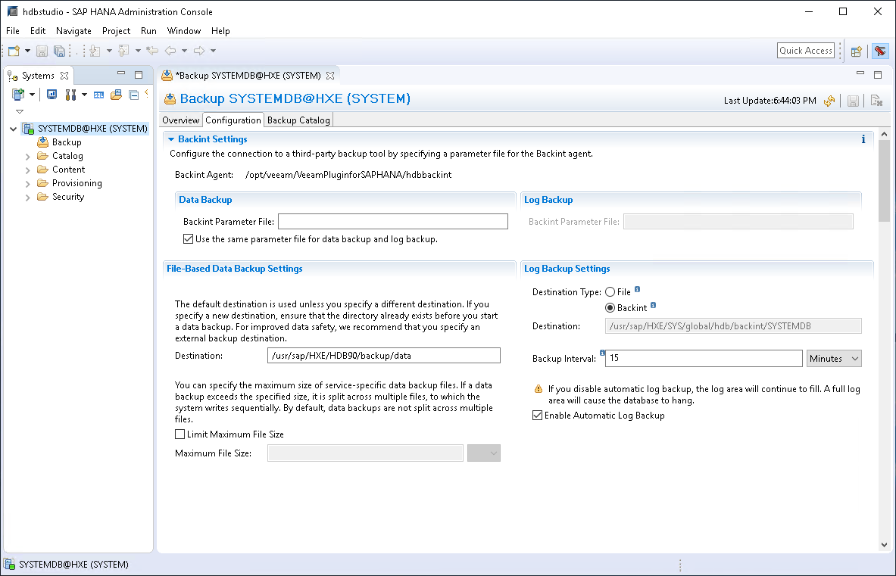

# Configuring Plug-In for SAP HANA

In this article

When you configure Veeam Plug-In settings, you set up integration settings between an SAP HANA server, Veeam Backup & Replication server and backup repositories where backup files will be stored. Veeam Plug-In uses the SapBackintConfigTool wizard to configure the integration settings. The wizard configures the SAP HANA Backint settings and creates the/opt/veeam/VeeamPluginforSAPHANA/veeam\_config.xml file.

|  |
| --- |
| Note |
| * The configuration of Veeam Plug-In must be performed by a user with database administrator rights on all SAP HANA instances of the server. * The SAP HANA High Level Isolation mode is not supported. |

See the following instructions:

* [Veeam Plug-In Configuration](#conf)
* [Configuration of Veeam Plug-In on Multiple SAP HANA Instances](#mult)
* [Verifying Configuration of Veeam Plug-In for SAP HANA](#verif)
* [Configuration Tool Parameters](#param)

Veeam Plug-In Configuration

To configure Veeam Plug-In, do the following:

1. Log in with operating system user (<sid>adm or a user with similar rights) and run the following command to launch the Veeam Plug-In configuration tool. You do not need root privileges if you have configured group access as described in the [Permissions](permissions_saphana.md) section.

|  |
| --- |
| SapBackintConfigTool --wizard |

If you have extracted files form the .TAR.GZ archive, go to the /opt/veeam/VeeamPluginforSAPHANA folder and run the following command:

|  |
| --- |
| ./SapBackintConfigTool --wizard |

1. Specify the DNS name or IP address of your Veeam Backup & Replication server.

|  |
| --- |
| Enter backup server name or IP address: serv02.tech.local |

1. Specify the port which will be used to communicate with the backup server. Default port: 10006.

|  |
| --- |
| Enter backup server port number: 10006 |

For details about other required ports, see [Ports](ports_vpsh.md).

1. Specify credentials to authenticate against the Veeam Backup & Replication server.

|  |
| --- |
| Enter username: serv02\administrator  Enter password for serv02\administrator: |

|  |
| --- |
| Important |
| Consider the following:   * You can work with backups created by Veeam Plug-In only with the account used for creating the backups. If you want to use another account, assign the Veeam Backup Administrator role or Veeam Backup Operator and Veeam Restore Operator roles to the account.   For details on how to assign Veeam Backup & Replication roles, see [Users and Roles](users_roles.md).   * The account must have access permissions on the required backup repository. To learn how to configure access permissions on repositories, see [Access and Encryption Settings on Repositories](repository_permissions.md). |

1. If you connect to the specified Veeam Backup & Replication server for the first time, provide the following confirmations:

1. Review the Veeam Backup & Replication server fingerprint and press y to confirm the connection to the specified server.

|  |
| --- |
| Veeam Backup & Replication server fingerprint: XX986XX6X6106XXXXX765X574X72X5X11502XXX8 |

1. Review requirements for the credentials and press y to confirm the connection using the specified credentials.

|  |
| --- |
| Please ensure the following roles are assigned to the user in Users and Roles settings on the backup server: Backup Administrator, or Backup Operator and Restore Operator  Alternatively, select a backup repository that does not have existing application backups created from this server under another user account.  Proceed anyway? (y/n): |

|  |
| --- |
| Tip |
| If you want to skip this step when connecting to the Veeam Backup & Replication server for the first time, you can disable it. For details, see [Configuration Tool Parameters](#disable). |

1. Select the backup repository where you want to store backups. In the terminal dialog, enter the number of the repository from the list of available repositories.

|  |
| --- |
| Available backup repositories:  1. serv10\_repo  SID SH2 has been configured |

|  |
| --- |
| Important |
| The used account must have access to Veeam backup repositories that you plan to use. Otherwise, the repositories will not be listed as available. To learn how to configure access permissions on repositories, see [Access and Encryption Settings on Repositories](repository_permissions.md). |

If you start the wizard for the first time on an SAP HANA scale-out cluster, the wizard asks you for a cluster name. The cluster name will be used by Veeam Backup & Replication to identify the backup job for the cluster. Further runs of the wizard within the SAP HANA scale-out cluster will not ask for this entry again.

Configuration of Veeam Plug-In on Multiple SAP HANA Instances

Configuration of Veeam Plug-In includes configuration or creation of the SAP HANA Backint symlinks on all SAP HANA instances. To be able to do this for multiple SAP HANA instances at the same time, the configuration must be performed by a user with root privileges. Alternatively, you can use an account from the sapsys user group to configure the plug-in and set the symlink for SAP HANA instances where the account has access rights. You can repeat the wizard under another account to configure additional SAP HANA instances.

Alternatively, you can configure a Linux security group. To do that, you must add all Veeam Plug-In admins to this security group and set the following rights:

|  |
| --- |
| chown root:<youradmingroup> /opt/veeam/VeeamPluginforSAPHANA/veeam\_config.xml  chmod 660 /opt/veeam/VeeamPluginforSAPHANA/veeam\_config.xml |

To learn about required permissions for backup and restore operations within SAP HANA, see [this SAP article](https://help.sap.com/viewer/6b94445c94ae495c83a19646e7c3fd56/2.0.03/en-US/c4b71703bb571014810ebb38dc59cf51.html).

Verifying Configuration of Veeam Plug-In for SAP HANA

When you finish the plug-in configuration wizard, the plug-in creates a soft link in the /hana/shared/<SID>/global/hdb/opt directory.

To verify that the Backint Agent is configured correctly, do the following:

1. Connect to the database using SAP HANA Studio.
2. Go to Backup/Configuration.
3. In the Backint Agent field, make sure that the specified path leads to /opt/veeam/VeeamPluginforSAPHANA/hdbbackint.

Configuration Tool Parameters

Apart from running a configuration wizard, you can use the SapBackintConfigTool tool to change a specific parameter in the veeam\_config.xml file or enable/disable Veeam Plug-In features.

|  |
| --- |
| Important |
| When you work with the command-line tool, use one configuration parameter per command. The tool does not support commands with multiple parameters. |

The following table lists available parameters for SapBackintConfigTool.

| Parameter | Description |
| --- | --- |
| --help | Shows the list of tool parameters. |
| --show-config | Shows configuration parameters. |
| --wizard | Starts the wizard to configure the plug-in settings. The wizard edits the Veeam Plug-In configuration file (veeam\_config.xml) or creates a new one if the configuration file was removed from the /opt/veeam/VeeamPluginforSAPHANA directory on the machine where Veeam Plug-In is installed. |
| --set-credentials <"serv\username"> <password> | Specifies credentials to log in to the Veeam Backup & Replication server. |
| --set-host <hostname> | Specifies the IP address or hostname of the Veeam Backup & Replication server. |
| --set-port <port\_number> | Specifies a port number that will be used to communicate with the Veeam Backup & Replication server. |
| --set-repository | Launches a wizard to select a backup repository. A backup repository is selected from repositories which are available in the connected Veeam Backup & Replication instance. |
| --set-backup-for-restore | [For System Copy] Specifies the backup that will be used for restore operations. You can use this parameter if you want to restore a database to another server or to restore a database from a backup copy.  When you run the SapBackintConfigTool command with this parameter, Veeam Plug-In will prompt you to select an authentication method to access a backup created for the original server and then select the backup from which you want to restore a database.  For more information, see [Restore to Another Server (System Copy)](restore_saphana_other_server.md). |
| --map-backup | Maps the [imported backups](import_backup_files.md). |
| --set-force-delete | Deletes backup files after specified days. |
| --promote-backup-copy-to-primary | Maps the imported backup copy to a regular Veeam Plug-In backup chain. |
| --set-scale-out-cluster-name | This command is supported for Veeam Plug-In operating in the managed mode. For more information, see [Standalone and Managed Operations Modes](overview_operation_modes.md#modes).  Sets the custom name for the cluster. During the Veeam Plug-In deployment on the scale-out system nodes, Veeam Backup & Replication sets the scale-out system name using domain name and SAP system name. If you want to set a custom name, use the --set-scale-out-cluster-name command on the computer side. This custom name will be saved in the veeam\_config.xml file. |
| --set-auth-data-for-restore | Specifies an authentication method for database restore. Use this parameter if you want to restore a database to another server using Veeam Explorer for SAP HANA.  After you run the SapBackintConfigTool command with this parameter, use the SapBackintConfigTool command with the --set-backup-for-restore parameter to select a backup from which you want to restore a database. For more information, see [Restore with Veeam Explorer for SAP HANA](restore_vehana.md). |
| --disable-fingerprint-confirmation | Use the --disable-fingerprint-confirmation parameter only with the --set-credentials parameter.  Disables a step of the Veeam Plug-In configuration process intended to confirm the first connection to the Veeam Backup & Replication server. During this step, Veeam Plug-In provides a fingerprint for the server for the user review. |
| --show-preferred-networks | Shows the list of preferred networks set for Veeam Plug-In data traffic to the remote backup repository.  The list shows set preferred networks in descending order of priority. If the list is empty, no networks are set as preferred and Veeam Plug-In routes data traffic to the preferred networks set in Veeam Backup & Replication. For more information, see [Specifying Preferred Networks for Veeam Plug-Ins](preferred_network_hana.md). |
| --add-preferred-network <network\_IP\_address> <position\_in\_list> | Adds a network to the list of preferred networks for Veeam Plug-In data traffic to the remote backup repository.  To select to which network Veeam Plug-In connects first, you can set the order number of the network in the list. For more information, see [Specifying Preferred Networks for Veeam Plug-Ins](preferred_network_hana.md). |
| --remove-preferred-network <network\_IP\_address> | Removes a specified network from the list of preferred networks for Veeam Plug-In data traffic to the remote backup repository. |

Example

To specify credentials that will be used to log in to the Veeam Backup & Replication server, use the plug-in configuration tool with the following command:

|  |
| --- |
| SapBackintConfigTool --set-credentials "serv02\Administrator" "password" |

Page updated 12/3/2025

Page content applies to build 13.0.1.1071
