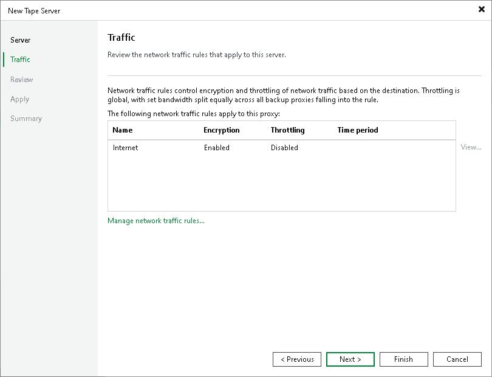

# Step 3. Configure Traffic Throttling Rules

At the Traffic step of the wizard, configure throttling rules to limit the outbound traffic rate for the tape server. Throttling rules will help you manage bandwidth usage and minimize the impact of tape jobs on network performance. For more information, see [Enabling Traffic Throttling](setting_network_traffic_throttling.md).

The list of throttling rules contains only those rules that are applicable to the tape server you are adding. The rule is applied to the tape server if its IP address falls under the source IP range of the rule. To view the rule settings, select it in the list and click the View button on the right.

You can also open global throttling settings and modify them directly from the wizard by clicking Manage network traffic throttling rules at the bottom of the window.

