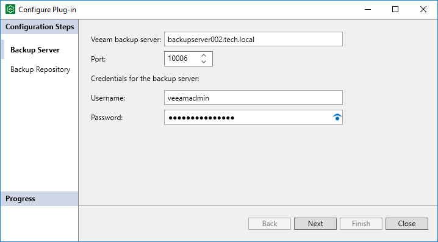
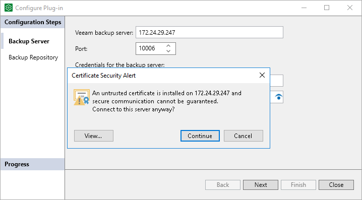
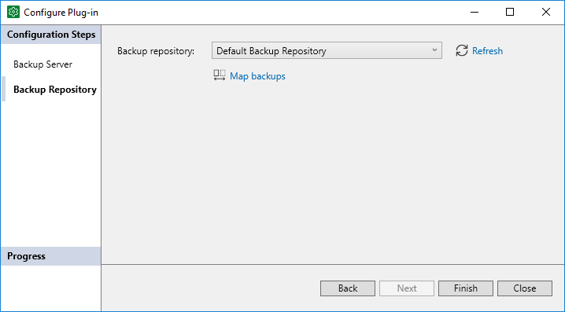

# Configuring Veeam Plug-In for Microsoft SQL Server

To use Veeam Plug-In, you must configure connection between Microsoft SQL Server, Veeam Backup & Replication server and backup repository where backup files will be stored.

|  |
| --- |
| Important |
| Before you configure Veeam Plug-In, you must allow access to Veeam backup repositories that you plan to use. To learn how to configure access permissions on backup repositories, see [Access and Encryption Settings on Backup Repositories](repository_permissions_mssql.md). |

To configure connection settings, use the Configure Plug-In wizard. The wizard configuresVeeam Plug-In settings and saves the settings to the Veeam Plug-In configuration file (veeam\_config.xml). The file is located in the %PROGRAMFILES%\Veeam\Plugins\Microsoft SQL folder on the machine where Veeam Plug-In is installed.

|  |
| --- |
| TIP |
| You can also configure Veeam Plug-In for Microsoft SQL Server using the MSSQLConfigTool.exe tool. To learn more, see [Configuring Veeam Plug-In with Command-Line Interface](#utility). |

To configure Veeam Plug-In, do the following:

1. On Microsoft SQL Server, launch the Configure Plug-In wizard. To do this, do either of the following:

* Click the Configure Plug-In icon on the desktop.

* From the Microsoft Windows Start menu, select All Programs > Veeam > Configure Plug-In or use the Microsoft Windows search to find the Configure Plug-In option on your machine.

* In Microsoft SQL Server Management Studio, click the Configure Plug-In button on the toolbar.
* Launch the %PROGRAMFILES%\Veeam\Plugins\Microsoft SQL\Veeam.Backup.MSSQLPlugin.UI.Configuration.exe file.

|  |
| --- |
| Important |
| You must run the Configure Plug-In wizard with elevated privileges (run as Administrator). |

1. At the Backup Server step of the wizard, specify settings to connect to the Veeam Backup & Replication server:

1. In the Veeam backup server field, specify a DNS name of the Veeam Backup & Replication server.
2. In the Port field, specify the port number over which Veeam Plug-In for Microsoft SQL Server will communicate with Veeam Backup & Replication. By default, Veeam Plug-In for Microsoft SQL Server uses port 10006.

For details about other required ports, see [Ports](ports_mssql.md).

1. In the Username and Password fields, specify credentials that will be used to connect to the Veeam Backup & Replication server.

1. If you connect to the specified Veeam Backup & Replication server for the first time, Veeam Plug-In displays the Certificate Security Alert window. After you review the certificate, click Continue to confirm the connection.

1. At the Backup Repository step of the wizard, do the following:

1. From the Backup repository drop-down list, select the required repository.

You can click Refresh to update the list of backup repositories. This may be helpful, for example, after you configure access to a backup repository and want to select this repository without the need to re-run the Configure Plug-In wizard.

1. You can map Veeam Plug-In for Microsoft SQL Server backup jobs to backups stored in the backup repository. Backup job mapping can be helpful if you moved backup files to a new backup repository and want to point backup jobs to existing backups in this new backup repository. You can also use backup job mapping if the configuration database got corrupted and you need to reconfigure backup jobs.

To map Veeam Plug-In for Microsoft SQL Server backup jobs to backups in the backup repository, click the Map backups link and select one or more backups in the Select Backups window.

You can map Veeam Plug-In for Microsoft SQL Server backup jobs to multiple backups in the backup repository. This may be helpful, for example, if you want to continue a backup chain for databases that operate as part of a failover cluster or availability group.

1. Click Finish to exit the wizard.

|  |
| --- |
| Important |
| You can work with backups created by Veeam Plug-In only under the account that was used for creating these backups. If you want to use another account, assign the Veeam Backup Administrator role or Veeam Backup Operator and Veeam Restore Operator roles to the account.  For details on how to assign Veeam Backup & Replication roles, see [Managing Users and Roles](users_roles.md). |

Configuring Veeam Plug-In with Command-Line Interface

To specify Veeam Plug-In for Microsoft SQL Server settings, you can use the MSSQLConfigTool.exe command-line tool. You can use commands to change a specific parameter in the veeam\_config.xml file or to enable or disable Veeam Plug-In features.

To specify Veeam Plug-In settings, do the following:

1. On Microsoft SQL Server, navigate to the %PROGRAMFILES%\Veeam\Plugins\Microsoft SQL\ folder.
2. Run the MSSQLConfigTool.exe command with the required parameters. For more information, see [Configuration Parameters](#options).

For example, to specify credentials that will be used to connect to the Veeam Backup & Replication server, use the following command:

|  |
| --- |
| MSSQLConfigTool.exe --set-credentials "administrator@srv16" "password" |

|  |
| --- |
| Important |
| When you work with the command-line tool, use one configuration parameter per command. The tool does not support commands with multiple parameters. |

Configuration Parameters

You can specify the following parameters for the MSSQLConfigTool.exe command:

| Parameter | Description |
| --- | --- |
| --help | Shows the list of parameters for the plug-in configuration tool. |
| --show-config | Shows the current Veeam Plug-In for Microsoft SQL Server configuration. |
| --set-credentials | Specifies credentials to connect to the Veeam Backup & Replication server. Provide a user name in the username@domain format and a password in the password format. If you do not provide a password as a value for this parameter, Veeam Plug-In will prompt you to specify a password. |
| --set-host | Specifies the domain name or IP address of the Veeam Backup & Replication server. |
| --set-port | Specifies the port over which to connect to the Veeam Backup & Replication server. |
| --set-repository | Specifies the name of the backup repository. If you do not provide the name of the backup repository as a value for this parameter, Veeam Plug-In will prompt you to select a backup repository from the list of repositories managed by the backup server. |
| --set-throttling | Limits bandwidth consumption for Veeam Plug-In backup jobs. For details, see [Configuring Performance Throttling](plan_and_manage_performance_throttling_mssql.md#throttle). |
| --promote-backup-copy-to-primary | Maps the imported backup copy to a regular Veeam Plug-In backup chain. |
| --set-force-delete | With this parameter, Veeam Plug-In deletes backup files which are older than specified number of days. Requires --days, --bkp and --repo parameters. For more information, see [Configuring Force Deletion of Backups](plugins_mssql_retention_force.md). |
| --days | Use the --days parameter only with the --set-force-delete parameter.  Specifies the retention period in days. After this period, Veeam Plug-In automatically force deletes the specified backup files. |
| --bkp | Use the --bkp parameter only with the --set-force-delete parameter.  Specifies the name of the backup. |
| --repo | Use the --bkp parameter only with the --set-force-delete parameter.  Specifies the name of the backup repository. |
| --show-preferred-networks | Shows the list of preferred networks set for Veeam Plug-In data traffic to the remote backup repository.  The list shows set preferred networks in descending order of priority. If the list is empty, no networks are set as preferred and Veeam Plug-In routes data traffic to the preferred networks set in Veeam Backup & Replication. For more information, see [Specifying Preferred Networks for Veeam Plug-Ins](preferred_network_mssql.md). |
| --add-preferred-network | Adds a network to the list of preferred networks for Veeam Plug-In data traffic to the remote backup repository.  To select to which network Veeam Plug-In connects first, you can set the order number of the network in the list. For more information, see [Specifying Preferred Networks for Veeam Plug-Ins](preferred_network_mssql.md). |
| --remove-preferred-network | Removes a specified network from the list of preferred networks for Veeam Plug-In data traffic to the remote backup repository. For more information, see [Specifying Preferred Networks for Veeam Plug-Ins](preferred_network_mssql.md). |
| --set-auth-data-for-restore | Specifies the authentication method for database restore. Use this parameter if you want to restore a database to another server or to restore a database from a backup copy.  After you run the MSSQLConfigTool.exe command with this parameter, use the MSSQLConfigTool.exe command with the --exclude-from-managed-mode parameter to select a database that you want to back up from the Microsoft SQL Server side. |
| --get-file-content | Use the --get-file-content parameter only with the ---set-auth-data-for-restore parameter.  Specifies the path to an .XML file. If you use the --get-file-content parameter, the authentication data will be retrieved from the specified .XML file. |
| --exclude-from-managed-mode | For Veeam Plug-In for Microsoft SQL Server in the managed mode, specifies databases that are excluded from the backup scope of an application backup policy. You can back up these databases using a standalone backup job from Microsoft SQL Server. Requires --instance and --d parameters. For more information, see [Backing Up SQL Databases with Standalone Backup Job](mssql_configure_backup_exclude_from_managed.md). |
| --remove-from-exclusions | Use the --remove-from-exclusions parameter only with the --exclude-from-managed-mode parameter.  Removes database from the list of exclusions that was created with the --exclude-from-managed-mode parameter. After you remove the database from the list of exclusions, you can back up this database again using an application backup policy. |
| --instance | Use the --instance parameter only with the --exclude-from-managed-mode parameter.  Specifies the instance whose databases are are excluded from the backup scope of an application backup policy. |
| --d | Use the --d parameter only with the --exclude-from-managed-mode parameter.  Specifies the databases that are excluded from the backup scope of an application backup policy. |

