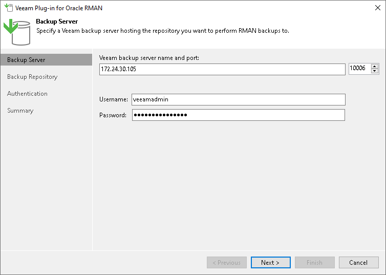
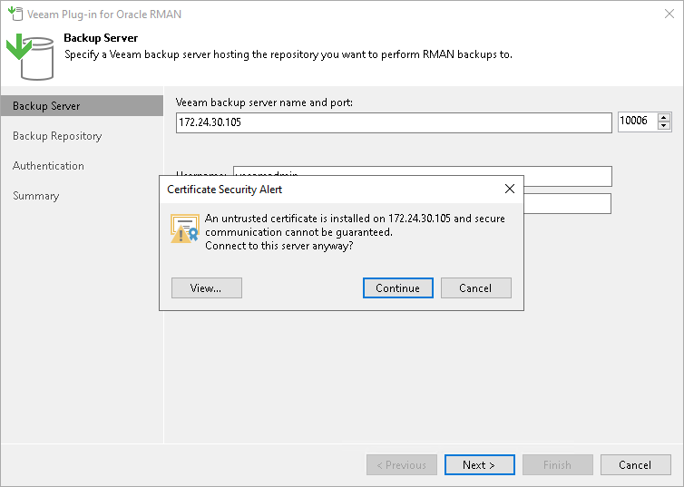
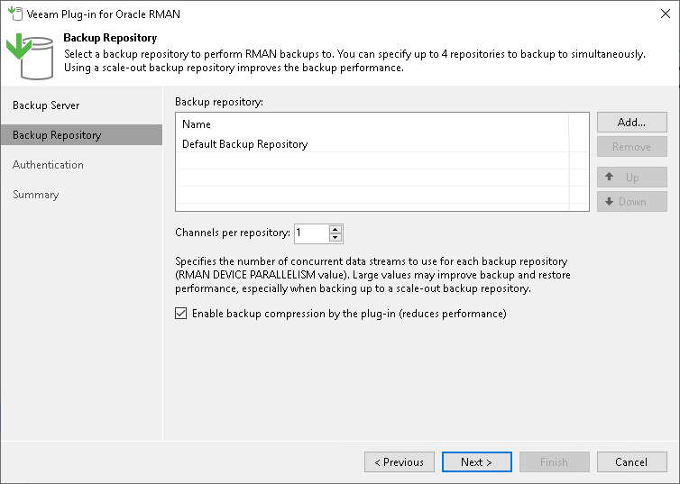
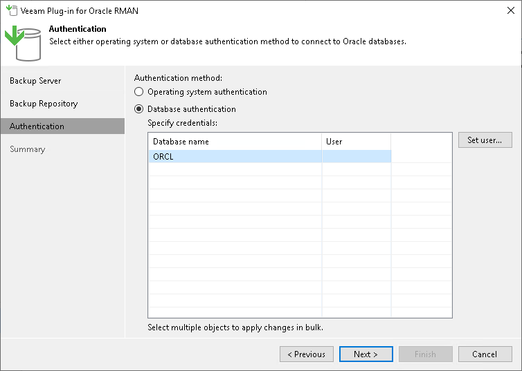
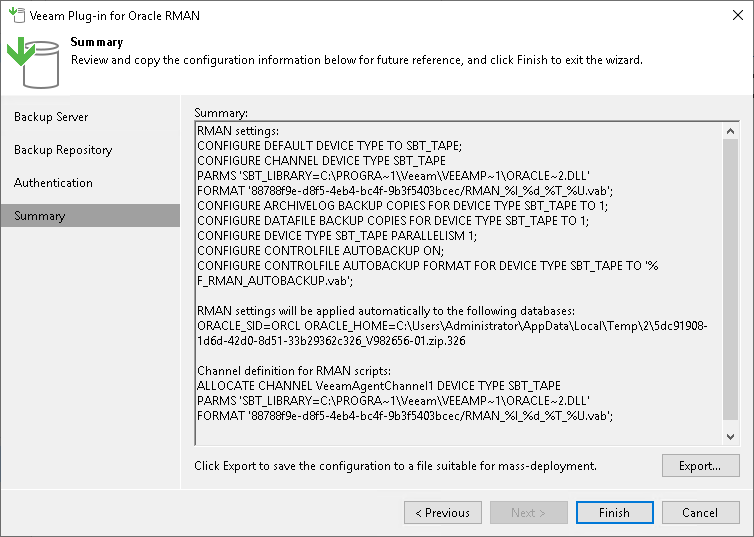

# Configuring Plug-In on Microsoft Windows

In this article

To configure backup, restore and authentication settings, use the Veeam Plug-In for Oracle RMAN configuration wizard. The wizard configures Oracle RMAN settings and creates the Veeam Plug-In configuration file (veeam\_config.xml) which is stored in the %PROGRAMFILES%\Veeam\VeeamPluginforOracleRMAN folder on the machine where Veeam Plug-In is installed.

Note that configuration wizard of Veeam Plug-In for Oracle RMAN changes the settings of Oracle RMAN. All original settings of Oracle RMAN are saved in the %PROGRAMFILES%\Veeam\VeeamPluginforOracleRMAN\RMANParameters.xml file.

To configure Veeam Plug-In, do the following:

1. On the Oracle server, click launch the Veeam RMAN Configuration Wizard (%PROGRAMFILES%\Veeam\VeeamPluginforOracleRMAN\Veeam.Backup.RMAN.Configuration.exe).
2. At the Backup Server step of the wizard, specify the DNS name of the Veeam Backup & Replication server and OS user account credentials that will be used to connect to the server.

1. If you connect to the specified Veeam Backup & Replication server for the first time, Veeam Plug-In displays the Certificate Security Alert window. After you review the certificate, click Continue to confirm the connection.

1. At the Backup Repository step of the wizard:

1. Click Add and select the required repository. For Oracle Database Standard Edition, you can select only one repository. If you want to use the Oracle RMAN Backup Duplexing functionality, you can select up to four repositories. The copies of backups will be sent to all selected repositories.

You must allow access to Veeam backup repositories that you plan to use. To learn how to configure access permissions on repositories, see [Access and Encryption Settings on Repositories](repository_permissions.md).

1. If you want to use another repository, select the repository from the list and click Remove. Then, you can add another repository.
2. At the Channels per repository field, specify the number of allowed parallel data streams for each repository.
3. If you want to enable Veeam Plug-In compression, select the Enable backup compression by the plug-in check box.

Note that if you use Veeam Plug-In compression in combination with Oracle RMAN integrated compression (BACKUP AS COMPRESSED commands), it can slow down processing.

1. Click Next.

|  |
| --- |
| Important |
| You can work with backups created by Veeam Plug-In only with the account used for creating the backups. If you want to use another account, assign the Veeam Backup Administrator role or Veeam Backup Operator and Veeam Restore Operator roles to the account.  For details on how to assign Veeam Backup & Replication roles, see [Managing Users and Roles](users_roles.md). |

1. At the Authentication step of the wizard, you can select a preferred authentication method to connect to the backup database.

You can choose between the operating authentication and database authentication methods. With the OS authentication method, you can connect to the server and database using OS user credentials. With the database authentication method, you can connect to the server using OS user credentials and to the database using database user credentials. The OS user account must be a user on the Oracle server with the required permissions to run RMAN.

If you select the database authentication method, you must specify the database user account credentials. The OS user credentials are applied automatically.

Note that the Veeam Plug-In configuration tool changes the settings of Oracle RMAN. All original settings of Oracle RMAN are saved in the %PROGRAMFILES%\Veeam\VeeamPluginforOracleRMAN\RMANParameters.xml file.

For details, see [Authentication Against Database](rman_auth_methods.md).

* Select Operating system authentication, to choose the OS authentication method.

The OS user credentials are applied automatically.

* Select Database authentication, to choose the database authentication method.

You can configure credentials for each of the target databases or one set of credentials for multiple databases. You can update all database credentials using the OracleRMANConfigTool command, if needed. The list of set credentials is stored in the veeam\_config.xml configuration file.

By default, the database user account must have the SYSDBA permission on the database. To learn more about Oracle permissions, see [this Oracle article](https://docs.oracle.com/database/121/ADMIN/dba.htm#ADMIN11047). With Oracle Database 12c, you can also authenticate with a user account that has the SYSBACKUP privileges. To learn more, see [Authentication Against Database](rman_auth_methods.md#consider).

To set database credentials, perform one of the following:

* Select an individual database and click Set user to configure the database user account credentials.
* Select multiple databases and click Set user to configure common credentials for multiple target databases.

1. At the Summary step of the wizard, you can export the plug-in and Oracle RMAN configuration files. You can use the configuration files to apply the plug-in settings on other servers.

1. To export the veeam\_config.xml file click Export and select Veeam Config.
2. Click Finish.

|  |
| --- |
| Note |
| When you export the configuration files, Veeam Plug-In automatically enables Oracle's Controlfile Autobackup feature. This feature is required for [restoring with different settings](https://helpcenter.veeam.com/docs/vbr/explorers/rman_oracle_settings.html?ver=13) using Veeam Explorer for Oracle. |

|  |
| --- |
| Tip |
| It is recommended to save the configuration files, so that you can use it as a reference. For example, if you are planning to manually [allocate channels](rman_allocation_backup.md) for backup and restore operations, you will need the repository UUID. The RMAN configuration file (rman\_config.txt) contains an example for channel allocation definition for the target repository. You can use this statement in your backup/restore scripts. |

Configuration Tool Commands

Apart from running a configuration wizard, you can use the OracleRMANConfigTool.exe tool to change a specific parameter in the veeam\_config.xml file or enable/disable Veeam Plug-In features.

|  |
| --- |
| Important |
| When you work with the command-line tool, use one configuration parameter per command. The tool does not support commands with multiple parameters. |

To run a specific command, do the following:

1. On the Oracle server, go to %PROGRAMFILES%\Veeam\VeeamPluginforOracleRMAN.
2. Run the required OracleRMANConfigTool.exe command from the table below.

For example, to specify credentials that will be used to log in to the Veeam Backup & Replication server, use the plug-in configuration tool with the following command:

|  |
| --- |
| OracleRMANConfigTool.exe --set-credentials "serv02\Joelle" "password" |

| Command | Description |
| --- | --- |
| --help | Shows the list of parameters of the plug-in configuration tool. |
| --show-config | Shows configuration parameters. |
| --wizard | Starts the wizard to configure the plug-in settings. This wizard edits the Veeam Plug-In configuration file (veeam\_config.xml) or creates a new one if the configuration file was removed from the %PROGRAMFILES%\Veeam\VeeamPluginforOracleRMAN directory on the machine where Veeam Plug-In is installed. |
| --set-credentials <"serv\username"> <"password"> | Specifies credentials to connect to the Veeam Backup & Replication server. |
| --set-db-credentials | Specifies credentials to connect to a single database. |
| --set-host <hostname> | Specifies the host of the Veeam Backup & Replication server. |
| --set-port <port\_number> | Specifies the host to connect to the Veeam Backup & Replication server. |
| --set-repositories | Launches a wizard to select a backup repository. A backup repository is selected from repositories which are available in the connected Veeam Backup & Replication instance. |
| --set-parallelism <number\_of\_channels> | Configures Oracle RMAN parallelism settings. |
| --compression <y/n> | Enables/disables Veeam proprietary feature which compresses backup files. |
| --set-throttling | Enables/disables network traffic throttling. For more information, see [Configuring Performance Throttling](plan_and_manage_performance_throttling_rman.md#throttle). |
| --map-backup | Maps the imported backups. |
| --set-force-delete | Deletes backup files after specified days. |
| --promote-backup-copy-to-primary | Maps the imported backup copy to a regular Veeam Plug-In backup chain. |
| --set-auth-data-for-restore | Specifies an authentication method for database restore. Use this parameter if you want to restore a database to another server or to restore a database from a backup copy.  After you run the OracleRMANConfigTool command with this parameter, use the OracleRMANConfigTool command with the --set-backup-for-restore parameter to select a backup from which you want to restore a database. For more information, see [Restore to Another Server](restore_other_server_rman.md). |
| --get-backup-for-restore | Selects the backup for database restore. Use this parameter if you want to restore a database to another server or to restore a database from a backup copy.  You can run the OracleRMANConfigTool command with this parameter to select a backup after you have specified an authentication method to access the backup using the OracleRMANConfigTool --set-backup-for-restore command. For more information, see [Restore to Another Server](restore_other_server_rman.md). |
| --disable-fingerprint-confirmation | Use the --disable-fingerprint-confirmation parameter only with the --set-credentials parameter.  Disables a step of the Veeam Plug-In configuration process intended to confirm the first connection to the Veeam Backup & Replication server. During this step, Veeam Plug-In provides a fingerprint for the server for the user review. |
| --show-preferred-networks | Shows the list of preferred networks set for Veeam Plug-In data traffic to the remote backup repository.  The list shows set preferred networks in descending order of priority. If the list is empty, no networks are set as preferred and Veeam Plug-In routes data traffic to the preferred networks set in Veeam Backup & Replication. For more information, see [Specifying Preferred Networks for Veeam Plug-Ins](preferred_network_rman.md). |
| --add-preferred-network <network\_IP\_address> <position\_in\_list> | Adds a network to the list of preferred networks for Veeam Plug-In data traffic to the remote backup repository.  To select to which network Veeam Plug-In connects first, you can set the order number of the network in the list. For more information, see [Specifying Preferred Networks for Veeam Plug-Ins](preferred_network_rman.md). |
| --remove-preferred-network <network\_IP\_address> | Removes a specified network from the list of preferred networks for Veeam Plug-In data traffic to the remote backup repository. |

Page updated 12/5/2025

Page content applies to build 13.0.1.1071
