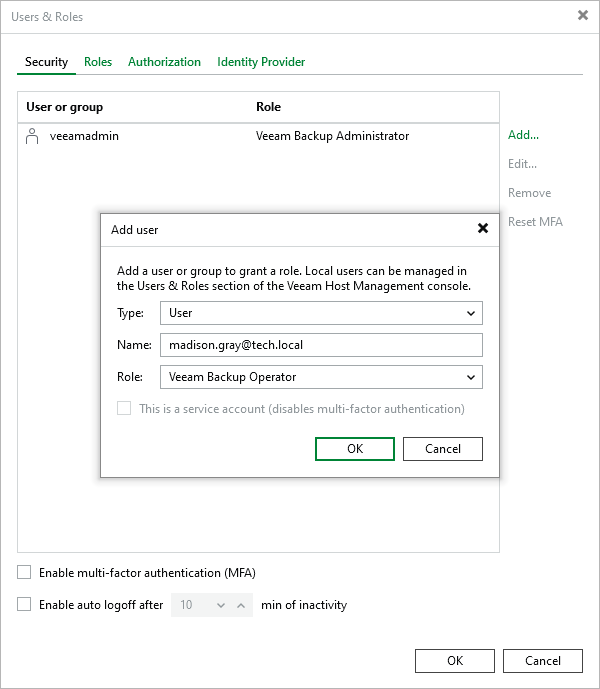

# Configuring Users Using Console

In this article

Adding Users

To add a user or user group:

1. From the main menu, select Users and Roles > Security.
2. Click Add.
3. In the Type field, select User or Group.
4. In the User or group field, enter the name of a user or user group in the UPN format, for example, john.doe@tech.local.

To add a default domain security group, use the group@domain format, for example, Administrators@tech.local. For more information on all security groups, see this [Microsoft article](https://learn.microsoft.com/en-us/windows-server/identity/ad-ds/manage/understand-security-groups#default-active-directory-security-groups).

1. From the Role list, select the desired role.
2. Click OK.

To reduce the number of user sessions opened for a long time, you can set the idle timeout to automatically log off users. To do this, select the Enable auto logoff after <number> min of inactivity check box and set the number of minutes.

For additional user verification, enable multi-factor authentication. For more information, see [Multi-Factor Authentication](mfa.md).

Editing Users

To edit a user or user group:

1. From the main menu, select Users and Roles > Security.
2. Select a user or user group.
3. Click Edit.
4. In the Edit window, you can do the following:

* Assign a new role to the account.
* Disable multi-factor authentication for the account. For more information, see [Disabling MFA for Service Accounts](mfa.md#disable_mfa_service_accounts).

1. Click OK.

Removing Users

To remove a user or user group:

1. From the main menu, select Users and Roles > Security.
2. Select a user or user group.
3. Click Remove.

Page updated 11/4/2025

Page content applies to build 13.0.1.1071
