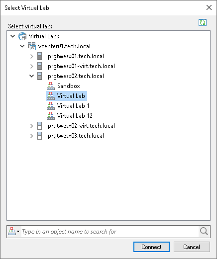

# Connecting to Existing Virtual Lab

You can connect an existing virtual lab and use this virtual lab for recovery verification. For example, you can connect to a virtual lab that has been created on another backup server.

To connect to a virtual lab:

1. Open the Backup Infrastructure view.
2. In the inventory pane, select Virtual Labs under SureBackup and click Connect Virtual Lab > VMware on the ribbon or right-click Virtual Labs and select Connect Virtual Lab > VMware.
3. Select the virtual lab and click Connect. To quickly find a virtual lab, use the search field at the bottom of the Select Virtual Lab window: enter a virtual lab name or a part of it in the field at the bottom and press [Enter] on the keyboard.

