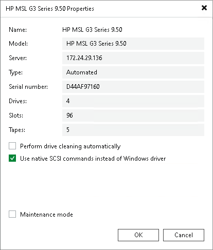

# Connecting Tape Devices

In this article

To deploy a tape device, you must perform the following steps:

1. Choose a machine that will act as the tape server. You can choose between the following options:

* [For Microsoft Windows-based backup server] Use the Veeam backup server as the tape server. This variant is sufficient for small environments with low traffic workloads.

Note that Veeam Software Appliance cannot be used as a tape server.

* As a tape server, you can use a Microsoft Windows or Linux server, physical or virtual, accessible by Veeam Backup & Replication. For the tape server system requirements, see [System Requirements](system_requirements.md#tape_server).

A dedicated tape server is recommended for installations with intense data transferring. A dedicated tape server allows you to manage remote tape libraries.

1. Connect the tape device to the machine that will perform the role of the tape server. You can connect the tape device in two ways:

* Directly over Fibre Channel (FC), Serial Attached SCSI (SAS), SCSI.
* Remotely with iSCSI (you can use Microsoft iSCSI initiator to establish the connection).

1. Install an appropriate device driver on the tape server.
2. If the medium changer driver is not available, check that the tape device uses native SCSI commands.

Open the Tape Infrastructure view, expand the Libraries node and select the needed library. Click Properties on the ribbon. You can also right-click the necessary library in the working area and select Properties. Select the Use native SCSI commands instead of Windows driver check box.

|  |
| --- |
| Important |
| Only media changers can use SCSI commands. Tape drives must use native OEM drivers. |

1. Add the tape server to Veeam Backup & Replication. For more information, see [Adding Tape Servers](adding_tape_server.md). Veeam Backup & Replication will automatically scan connected tape devices and display all discovered tape libraries and tape drives under the Libraries node in the Tape Infrastructure view. Afterward, the auto-discovery process will be performed periodically every 3 minutes.

You can connect multiple tape devices to each tape server. The connected tape devices will appear as list under the Libraries node in the Tape Infrastructure view.

Veeam Backup & Replication allows deploying multiple tape servers. However, if you have multiple Veeam backup servers, you cannot connect one tape server to several Veeam backup servers simultaneously.

|  |
| --- |
| Important |
| We strongly recommend not to connect each tape device to multiple tape servers at a time, as it may lead to conflicts. |

|  |
| --- |
| Tip |
| If you have several Veeam backup servers, you can easily reconnect a tape server to another Veeam backup server without reconfiguring the tape device: Veeam backup server will recognize the library settings automatically. Note that when you reconnect the tape server, the tape jobs will not run with another Veeam backup server unless you copy the configuration. |

Reconnecting Tape Devices to Another Tape Server

You can reconnect your tape devices to another tape server. For example, you can reconnect the tape devices from the backup server acting as a tape server to a dedicated tape server. To do this, choose a tape server and perform steps for connecting tape devices above. When you add the new tape server to Veeam Backup & Replication, Veeam Backup & Replication will recognize the tape devices and all tape device settings.

Page updated 10/20/2025

Page content applies to build 13.0.1.1071
