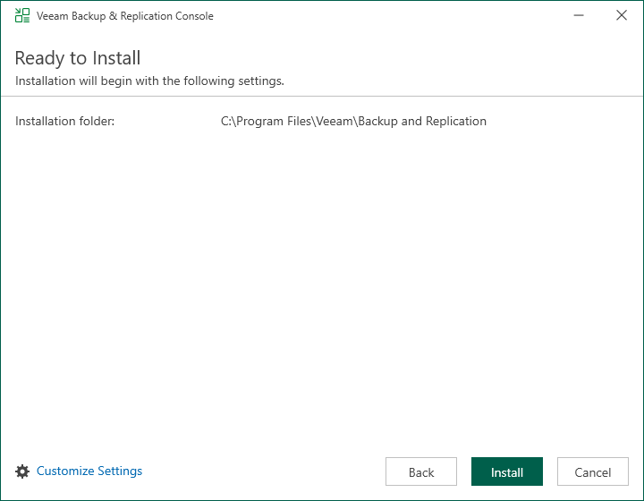

# Step 5. Review Default Installation Settings

At the Ready to Install step of the wizard, you can select to install the Veeam Backup & Replication console with default installation settings or specify custom installation settings.

* To use the default installation settings, click Install.
* To use custom installation settings, click Customize Settings. The setup wizard will include additional steps that will let you configure installation settings.

The following table lists the default installation settings.

| Setting | Default Value | Description |
| --- | --- | --- |
| Installation folder | C:\Program Files\Veeam\Backup and Replication | Folder where the Veeam Backup & Replication console will be installed. |

