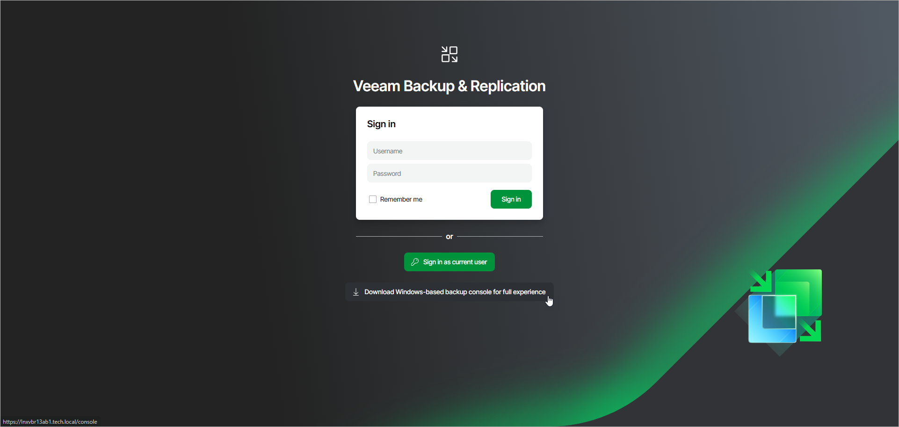
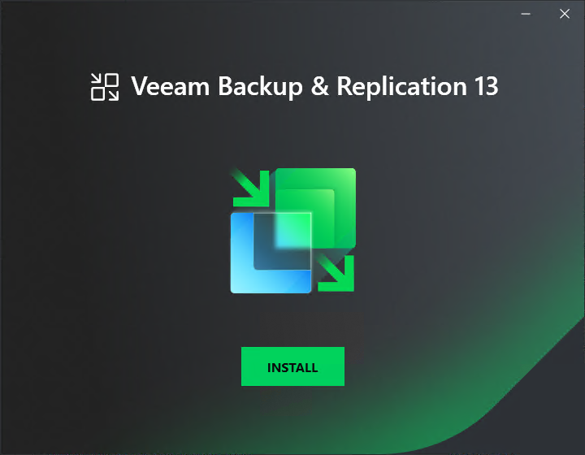

# Step 1. Start Setup Wizard

You can start the Veeam Backup & Replication console installation in the following ways depending on your installation type:

* Start the installation from the Veeam Backup & Replication console installer package. Use this option if your Veeam Backup & Replication installation is based on Veeam Software Appliance (Linux-based).

1. Download the Veeam Backup & Replication Console installer from the [Veeam Backup & Replication web UI logon page](web_ui_logon.md).
2. Run the downloaded installer package.

* Start the installation from the Veeam Backup & Replication installation image. Use this option if your Veeam Backup & Replication installation is based on Microsoft Windows server.

1. Download the latest version of the Veeam Backup & Replication installation image from the [Download Veeam Products](https://www.veeam.com/downloads.html) page.
2. Mount the installation image to the machine on which you plan to install the Veeam Backup & Replication console or burn the image file to a flash drive or other removable storage device. If you plan to install the Veeam Backup & Replication console on a VM, use built-in tools of the virtualization management software to mount the installation image to the VM.
3. To extract the content of the ISO, you can also use the latest versions of utilities that can properly extract data from ISOs of large size and can properly work with long file paths.
4. After you mount the image or insert the disk, Autorun will open a splash screen. If Autorun is not available or disabled, run the Setup.exe file from the image or disk.
5. In the splash screen, click Install.

|  |
| --- |
| Important |
| It is strongly recommended that you install the Veeam Backup & Replication console using Autorun or the Setup.exe file. If you run other installation files from the ISO folders, you may miss some components that need to be installed, and the Veeam Backup & Replication console may not work as expected. |

