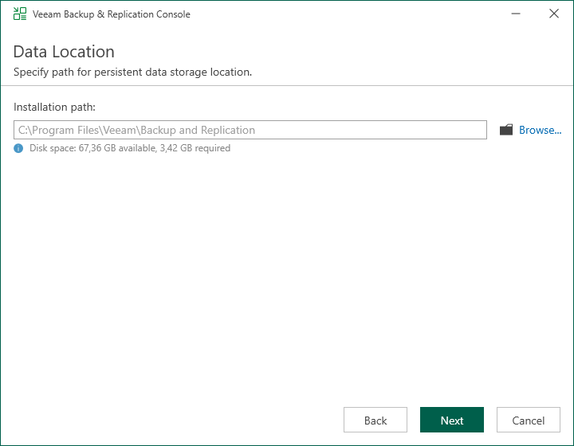

# Step 6. Specify Installation Path

In this article

The Data Location step is available if you have selected to configure installation settings manually.

At this step of the wizard, you can choose the installation folder for the Veeam Backup & Replication console.

1. On the right of the Installation path field, click Browse.
2. In the Select Folder window, select the installation folder for the product. The default folder is C:\Program Files\Veeam\Backup and Replication\.

Page updated 10/22/2025

Page content applies to build 13.0.1.1071
