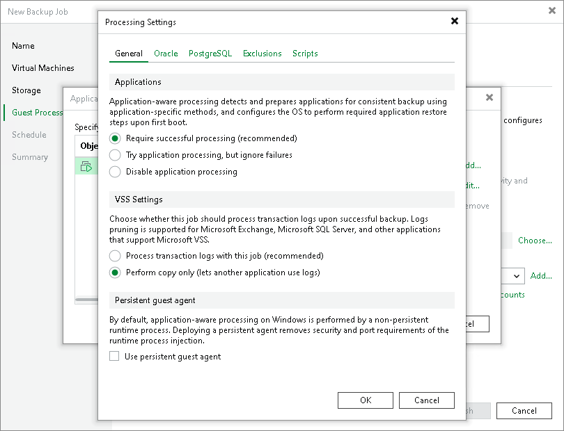

# Copy-Only Backup

Some organizations prefer to back up Microsoft SQL Server databases and transaction logs with native Microsoft SQL Server tools or 3rd party backup tools. To restore database systems properly, database administrators must ensure they have database backups and a sequence of transaction log backups associated with these backups at hand.

If you use native Microsoft SQL Server tools or 3rd party backup tools and also want to back up Microsoft SQL Server VMs with Veeam Backup & Replication, you must enable the Perform copy only option in the job settings.

The Perform copy only option indicates that a chain of database backups is created by native Microsoft SQL Server means or by a 3rd party tool and instructs Veeam to preserve this chain (backup history). Veeam Backup & Replication backs up the Microsoft SQL Server VM using the VSS\_BS\_COPY method for snapshot creation. The VSS\_BT\_COPY method produces a copy-only backup — the backup that is independent of the existing chain of database backups and does not contain transaction logs data. As a result, the copy-only backup does not change the log sequence number and transaction log backup time.

|  |
| --- |
| Important |
| Veeam Backup & Replication does not truncate transaction logs after copy-only backup. For this reason, if you instruct the backup job to perform copy-only backup, you cannot specify transaction log handling settings for this job. |

