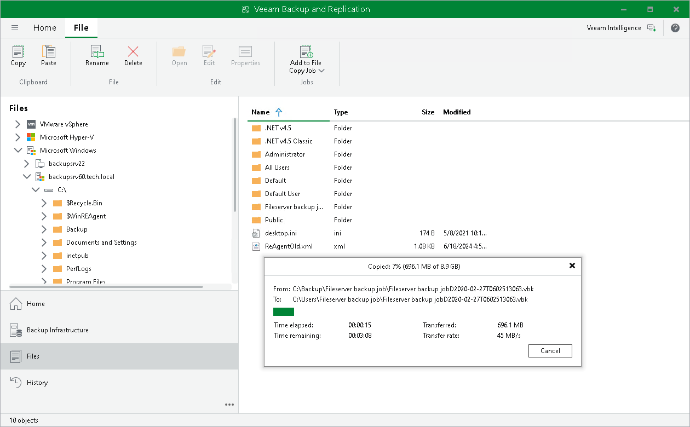

# Copying Files and Folders Manually

You can manually copy and move files and folders between servers and hosts added to the backup infrastructure.

Veeam Backup & Replication lets you copy files manually between the following backup infrastructure objects:

* Virtualization hosts
* Microsoft Windows servers
* Linux servers that are not used as hardened repositories
* Deduplicating storage appliances used as backup repositories

|  |
| --- |
| Important |
| You cannot copy backup files (VBK, VIB and VRB) to HPE StoreOnce storage appliances used as backup repositories. To copy such files, use backup copy jobs. |

To copy files and folders:

1. Open the Files view.
2. In the inventory pane, expand the file tree of the source server or host.
3. Right-click the files and folders you want to copy and select Copy.
4. In the inventory pane, expand the file tree of the target server or host.
5. Right-click the destination folder and select Paste.

You can also use a drag and drop operation to copy files and folders between the source and target hosts or servers.

