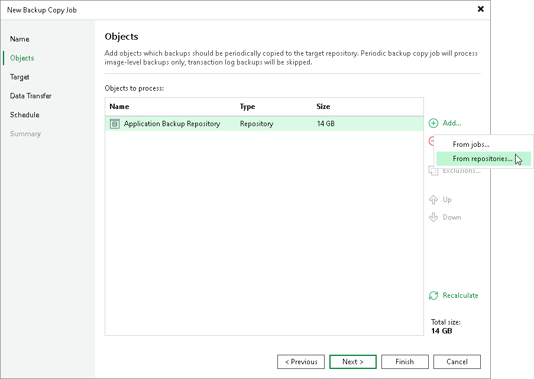

# Creating Backup Copy Jobs for Application Backup Repositories

A backup copy job for application backup repository snapshots is a variant of a standard backup copy job. To create a backup copy job for an application backup repository, you need to launch the New Backup Copy Job wizard and select the application backup repository at the Objects step. For details, see [Creating Backup Copy Jobs for VMs and Physical Machines Using Console](backup_copy_create.md).

Related Topics

* [Creating Backup Copy Jobs for VMs and Physical Machines Using Console](backup_copy_create.md)
* [Performing Application Backup Repository Restore from Backup Copy](abr_restore_bcj.md)

Page updated 2026-07-16

