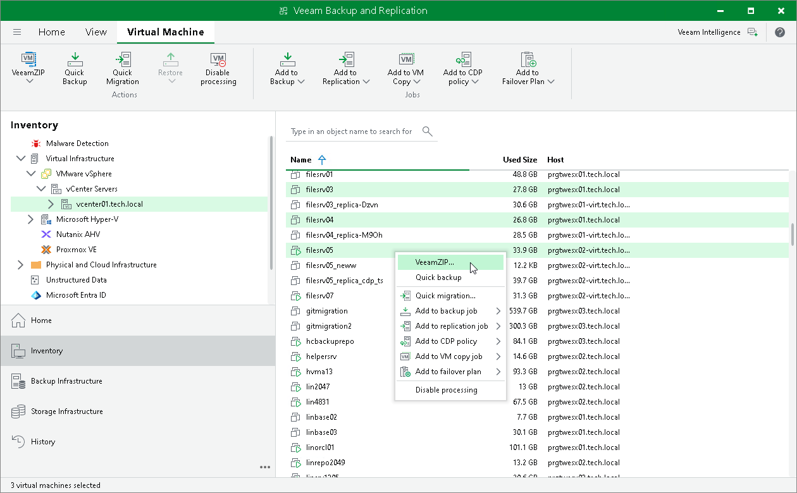
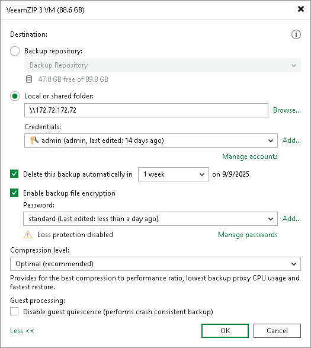

# Creating VeeamZIP Backups

You can quickly back up running and powered off VMs with VeeamZIP. VeeamZIP can be helpful if you want to create an ad-hoc backup for VMs, archive VMs before decommissioning and so on. You can create VeeamZIP backups for one or more VMs.

|  |
| --- |
| Tip |
| Veeam Backup & Replication keeps settings of the latest VeeamZIP task. To quickly create VeeamZIP backups with the same settings and store backups in the same location, right-click the necessary VM and select VeeamZIP to. |

To create VeeamZIP backups:

1. Open the Inventory view. In the infrastructure tree, select a host or VM container in which the VMs that you want to back up reside.
2. In the working area, select the VMs and click VeeamZIP > VeeamZIP on the ribbon or right-click the VMs and select VeeamZIP.

To quickly find the necessary VMs, type the VM name or a part of it in the search field at the top of the working area and click the Start search button on the right or press [Enter] on the keyboard.

1. In the opened VeeamZIP <N> VM window:

1. In the Destination section, specify a location in which you want to store VeeamZIP backups.

* To store VeeamZIP backups in a backup repository, select Backup repository and choose the necessary backup repository from the list. In this case, VeeamZIP backups will be saved to the VeeamZIP subfolder of the folder where the backup repository stores backups. You can check this folder at the [Configure Backup Repository Settings](repository_repository.md) step of the backup repository wizard.
* To store VeeamZIP backups in a local folder on the backup server, select Local or shared folder, click Browse on the right and select a folder in which VeeamZIP backups must be stored.
* To store VeeamZIP backups in a shared folder, select Local or shared folder and type in the UNC name of the shared folder in the field under it. Keep in mind that the UNC name always starts with two back slashes (\\).

If the shared folder requires authentication, select the necessary credentials from the Credentials list. If you have not set up credentials beforehand, click the Manage accounts link or click Add on the right to add necessary credentials. For more information, see [Credentials Manager](credentials_manager.md).

1. If you want to specify retention settings for the created VeeamZIP backups, select the Delete this backup automatically check box. From the drop-down list, select the retention period. The VeeamZIP backup file will be removed at 12:00:00 AM on the next day after the retention period ends.

[For hardened repository] Veeam Backup & Replication sets an immutability period for backup files with retention period as equal to the longest of these periods. For more information, see [How Immutability Works](hardened_repository_immutability.md#retention).

If you do not want to delete VeeamZIP backups, leave the Delete this backup automatically check box unselected.

|  |
| --- |
| Tip |
| You can customize retention period values in the drop-down list as described in [this Veeam KB article](https://www.veeam.com/kb4537). |

1. To encrypt VeeamZIP backups, select the Enable backup file encryption check box. In the Password field, select the encryption method you want to use — a password that will generate secret keys or an external KMS server that will generate KMS keys. For more information about VeeamZIP encryption, see [Encrypting VeeamZIP Backups](encrypting_veeam_zip.md).

If you have not created the password beforehand, click Add or use the Manage passwords link to specify a new password. For more information, see [Password Manager](password_manager.md).

If you do not use password loss protection, Veeam Backup & Replication will display a warning about it. For more information, see [Password Loss Protection](encryption_password_loss_protection.md).

1. From the Compression level list, select a compression level for created backups.
2. By default, Veeam Backup & Replication uses platform native quiescing mechanisms to create a transactionally consistent image of VMs. You can disable VM quiescence. To do this, select the Disable guest quiescence check box. In this case, Veeam Backup & Replication will create a crash-consistent VM backup.
3. Click OK. The VeeamZIP task will start immediately. Veeam Backup & Replication will create a full backup file (VBK) and store it in the specified location. The VM name, date and time of the file creation are appended to the file name so you can easily find the necessary backups afterwards.

1. As the job runs, you can track the job performance in the real-time mode. To see the job results once it completes, open the History view, expand the Jobs node and click Backup. Then double-click the job session in the list.

