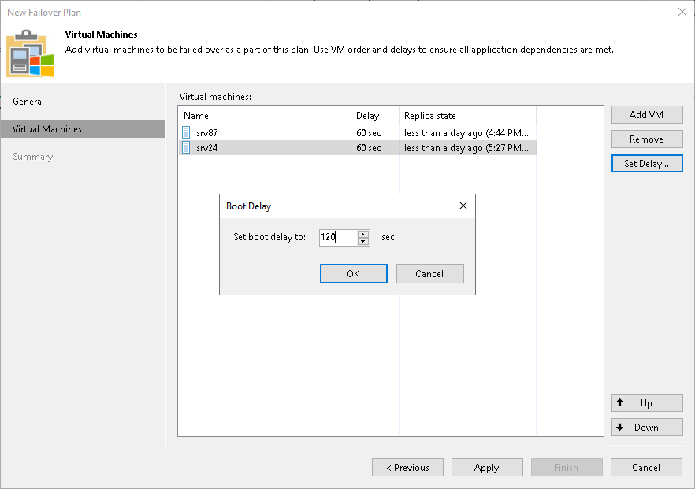

# Step 5. Set Time Delay

In this article

After you have set the order for VMs in the failover plan, you need to set a time delay for VMs. The delay time defines for how long Veeam Backup & Replication must wait before starting the failover operation for the next VM in the list. You can use time delays to make sure that some VMs are already running at the moment dependent VMs start.

For example, you have added 2 VMs to the failover plan and set a time delay to 60 seconds for the first VM in the list. Veeam Backup & Replication will perform failover in the following manner: Veeam Backup & Replication will start the failover operation for the first VM in the list, then wait for 60 seconds and start the failover operation for the second VM in the list.

|  |
| --- |
| Note |
| Time delays can be specified for all VMs in the list except the last one. If you do not specify time delays, VMs will be started simultaneously. |

To set the time delay for a VM:

1. Select it and click Set Delay on the right or double-click the VM in the list.
2. Enter the time interval that you consider sufficient for this VM to boot.

Page updated 1/24/2025

Page content applies to build 13.0.1.1071
