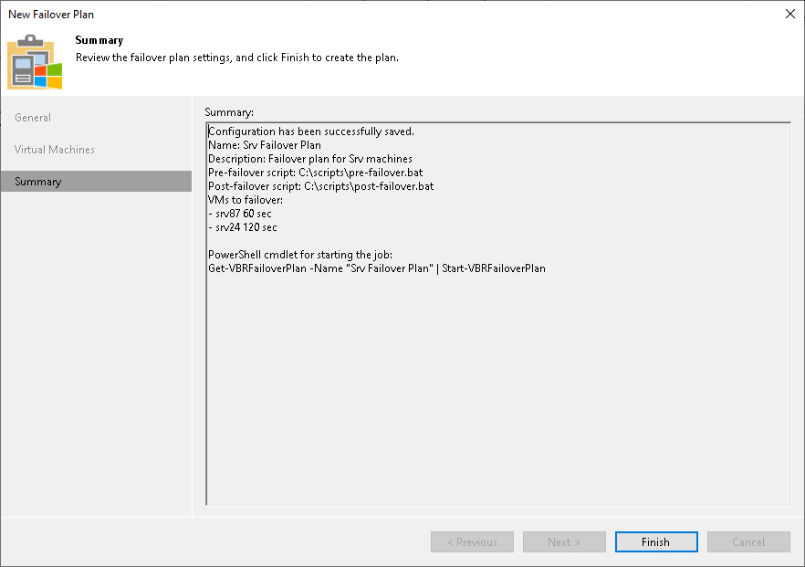

# Step 6. Finish Working with Wizard

In this article

At the Summary step of the wizard, review details for the configured failover plan and click Finish to create the plan.

Page updated 1/24/2025

Page content applies to build 13.0.1.1071
