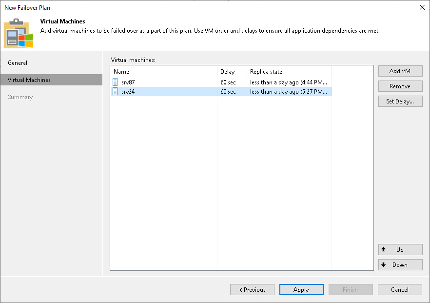

# Step 3. Select VMs

At the Virtual Machines step of the wizard, select VMs that you want to add to the failover plan. You can add separate VMs and whole VM containers.

To add VMs and VM containers:

1. Click Add VM.
2. Select where to browse for VMs and VM containers:

* From infrastructure — browse the virtual environment and select VMs or VM containers. If you choose a VM container, Veeam Backup & Replication will expand it to a plain VM list.

* From replicas — browse existing replication jobs and select all VMs or specific VMs from replication jobs.

To quickly find the necessary VMs or VM containers, you can use the search fields.

|  |
| --- |
| Note |
| A source from which you add a VM to a failover plan does not affect whether you fail over to the latest or specific restore point. It is the command that you select when starting a failover plan that defines the restore point. For more information, see [Running Failover Plans](running_failover_plans_hv.md). |

