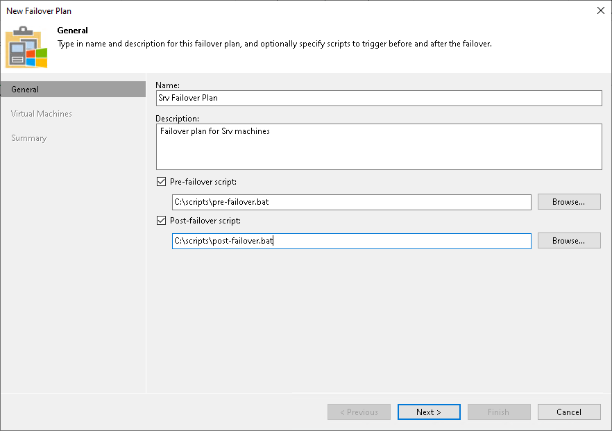

# Step 2. Specify Failover Plan Name and Description

In this article

At the General step of the wizard, specify a name and description for the failover plan.

If you want to execute custom scripts before or after the failover plan, select the Pre-failover script and Post-failover script check boxes and click Browse to choose executable files. For example, you may want stop some applications on production VMs before the failover plan starts or send an email to backup administrators after the failover plan finishes.

The scripts will be executed on the backup server. Veeam Backup & Replication supports the script files in the following formats: BAT, CMD, EXE and PS1.

Page updated 1/24/2025

Page content applies to build 13.0.1.1071
