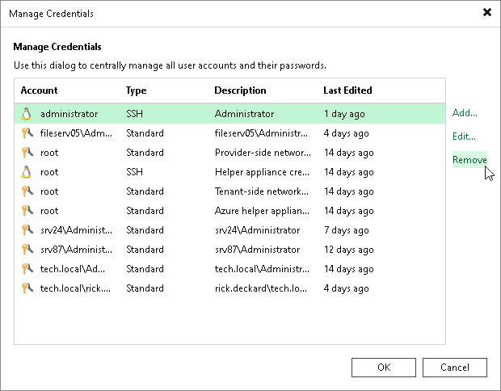

# Editing and Deleting Credentials Records

You can edit or delete credentials records that you have created. For the system credentials records, you can only change a password and record description. These credentials records cannot be deleted.

To edit a credentials record:

1. From the main menu, select Credentials and Passwords > Datacenter Credentials.
2. Select the credentials record in the list and click Edit.
3. If the credentials record is already used for any component in the backup infrastructure, Veeam Backup & Replication will display a warning. Click Yes to confirm your intention.
4. Edit settings of the credentials record as required.

To delete a credentials record:

1. From the main menu, select Credentials and Passwords > Datacenter Credentials.
2. Select the credentials record in the list and click Remove.

|  |
| --- |
| Note |
| You cannot delete a record that is already used for any component in the backup infrastructure. If you still need to do it, use a temporary record with dummy credentials for the required component and perform the rescan operation for this component. After that, you will be able to delete the record. |

