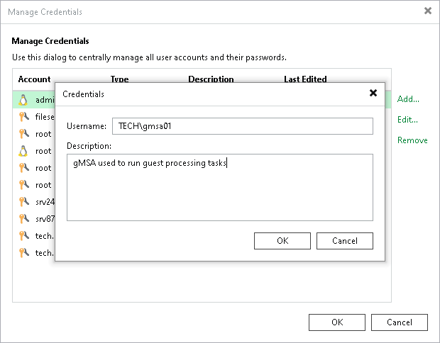

# Creating Managed Service Account Using Console

In this article

To add a new credentials record with the gMSA, do the following in the Veeam Backup & Replication console:

1. From the main menu, select Credentials and Passwords > Datacenter Credentials.
2. Click Add > Managed service account.
3. In the Username field, enter a gMSA that you want to add. Note that the name of the account must be specified in the following format: DOMAIN\User or user@domain.xxx.
4. In the Description field, enter a description for the created credentials record. As there can be a number of similar account names, for example, gmsa01, it is recommended that you provide a meaningful unique description for the credentials record so that you can distinguish it in the list. The description is shown in brackets, following the user name.

Page updated 7/31/2025

Page content applies to build 13.0.1.1071
