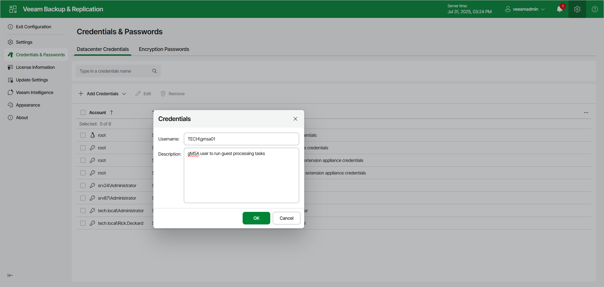

# Creating Managed Service Account Using Web UI

To add a new credentials record with the gMSA, do the following in the Veeam Backup & Replication web UI:

1. Click the gear icon in the top bar.
2. Select Credentials & Passwords in the management pane.
3. In the Datacenter Credentials tab, click Add Credentials > Managed service account.
4. In the Username field, enter a gMSA that you want to add. Note that the name of the account must be specified in the following format: DOMAIN\User or user@domain.xxx.
5. In the Description field, enter a description for the created credentials record. As there can be a number of similar account names, for example, gmsa01, it is recommended that you provide a meaningful unique description for the credentials record so that you can distinguish it in the list. The description is shown in brackets, following the user name.
6. Click OK.

