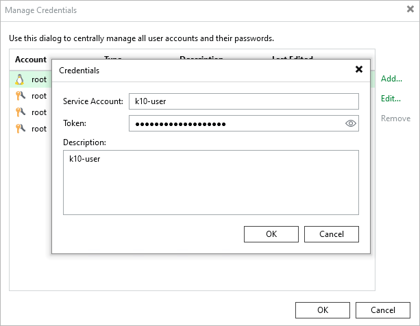

# Kasten Authentication Tokens

If you use Veeam Kasten for Kubernetes as a part of your backup infrastructure, you can add a credentials record in Veeam Backup & Replication. After you add a token, you will be able to manage your Veeam Kasten for Kubernetes policies and restore points from the Veeam Backup & Replication console.

To add a new Kasten authentication token record, do the following in the Veeam Backup & Replication console:

1. From the main menu, select Credentials and Passwords > Datacenter Credentials.
2. Click Add > Kasten authentication token.
3. In the Service Account field, specify a name for the service account.
4. In the Token field, specify the bearer token of a cluster service account that has the k10-admin ClusterRole. For more information, see [Obtaining Tokens](https://docs.kasten.io/latest/access/authentication.html#obtaining-tokens) and [Default Veeam Kasten ClusterRoles](https://docs.kasten.io/latest/access/rbac.html#default-veeam-kasten-clusterroles) in the Veeam Kasten Integration Guide.
5. In the Description field, enter a description for the created credentials record. You should provide a meaningful unique description for the credentials record so that you can distinguish it in the list. The description is shown in brackets, following the user name.

|  |
| --- |
| Note |
| You cannot add a Kasten authentication token record in the Web UI. |

