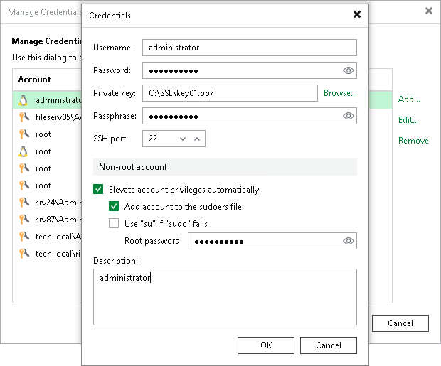

# Creating SSH Private Key Using Console

To add a credentials record using the Identity/Pubkey authentication method in the Veeam Backup & Replication console, do the following:

1. Generate a pair of keys using a key generation utility, for example, ssh-keygen.

Note that keys generated as ED448 as are not supported.

1. Place the public key on a Linux server. To do this, add the public key to the authorized\_keys file in the .ssh/ directory in the home directory on the Linux server.
2. Place the private key in some folder on the backup server or in a network shared folder.
3. In the Veeam Backup & Replication console, from the main menu select Credentials and Passwords > Datacenter Credentials.
4. Click Add > SSH private key.
5. In the Username field, specify a user name for the created credentials record.
6. In the Password field, specify the password for the user account. The password is required in all cases except when you use root or a user with enabled NOPASSWD:ALL setting in /etc/sudoers.
7. In the Private key field, enter a path to the private key or click Browse to select a private key.
8. In the Passphrase field, specify a passphrase for the private key on the backup server. To view the entered passphrase, click and hold the eye icon on the right of the field.
9. In the SSH port field, specify a number of the SSH port that you plan to use to connect to a Linux server. By default, port 22 is used.
10. If you specify data for a non-root account that does not have root permissions on a Linux server, you can use the Non-root account section to grant sudo rights to this account.

1. To provide a non-root user with root account privileges, select the Elevate account privileges automatically check box.
2. To add the user account to sudoers file, select the Add account to the sudoers file check box. In the Root password field, enter the password for the root account.

If you do not enable this option, you will have to manually add the user account to the sudoers file.

1. When registering a Linux server, you have an option to failover to using the su command for distros where the sudo command is not available.

To enable the failover, select the Use "su" if "sudo" fails check box and in the Root password field, enter the password for the root account.

1. In the Description field, enter a description for the created credentials record. As there can be a number of similar account names, for example, Root, it is recommended that you supply a meaningful unique description for the credentials record so that you can distinguish it in the list. The description is shown in brackets, following the user name.

|  |
| --- |
| Important |
| Cases when root password is required to elevate account rights to root using sudo are no longer supported. |

