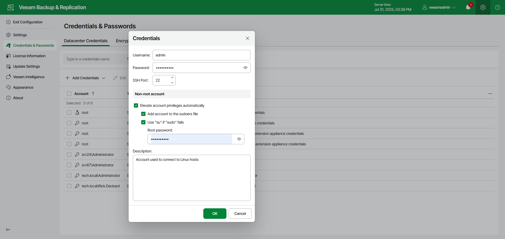

# Creating SSH Credentials Using Web UI

To add a new credentials record with a user name and password for a Linux server, do the following in the Veeam Backup & Replication web UI:

1. Click the gear icon in the top bar.
2. Select Credentials & Passwords in the management pane.
3. In the Datacenter Credentials tab, click Add Credentials > SSH credentials.
4. In the Username field, enter a user name for the account that you plan to add.
5. In the Password field, enter a password for the account that you want to add. To view the entered password, click and hold the eye icon on the right of the field.
6. In the SSH port field, specify the SSH port over which you want to connect to a Linux server. By default, port 22 is used.
7. If you specify data for a non-root account that does not have root permissions on a Linux server, you can use the Non-root account section to grant sudo rights to this account.

1. To provide a non-root user with root account privileges, select the Elevate account privileges automatically check box.
2. To add the user account to sudoers file, select the Add account to the sudoers file check box. In the Root password field, enter the password for the root account.

If you do not enable this option, you will have to manually add the user account to the sudoers file.

1. If you plan to use the account to connect to Linux servers where the sudo command is not available or fails, you have an option to use the su command instead. To enable the su command, select the Use "su" if "sudo" fails check box and in the Root password field, enter the password for the root account.

Veeam Backup & Replication will first try to use the sudo command. If the attempt fails, Veeam Backup & Replication will use the su command.

1. In the Description field, enter a description for the created credentials record. As there can be a number of similar account names, for example, Root, it is recommended that you provide a meaningful unique description for the credentials record so that you can distinguish it in the list. The description is shown in brackets, following the user name.
2. Click OK.

|  |
| --- |
| Important |
| Consider the following:   * You can create a separate user account intended for work with Veeam Backup & Replication on a Linux-based VM, grant root privileges to this account and specify settings of this account in the Credentials Manager. It is recommended that you avoid additional commands output for this user (like messages echoed from within ~/.bashrc or command traces before execution) because they may affect Linux VM processing. * Cases when root password is required to elevate account rights to root using sudo are no longer supported. |

