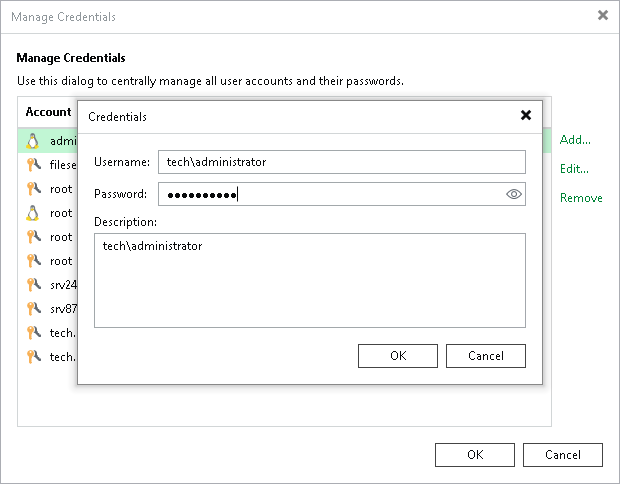

# Creating Standard Account Using Console

To add a new standard credentials record, do the following in the Veeam Backup & Replication console:

1. From the main menu, select Credentials and Passwords > Datacenter Credentials.
2. Click Add > Standard account.
3. In the Username field, enter a user name for the account that you want to add. You can also click Browse to select an existing user account.
4. In the Password field, enter a password for the account that you want to add. To view the entered password, click and hold the eye icon on the right of the field.
5. In the Description field, enter a description for the created credentials record. As there can be a number of similar account names, for example, Administrator, it is recommended that you provide a meaningful unique description for the credentials record so that you can distinguish it in the list. The description is shown in brackets, following the user name.

