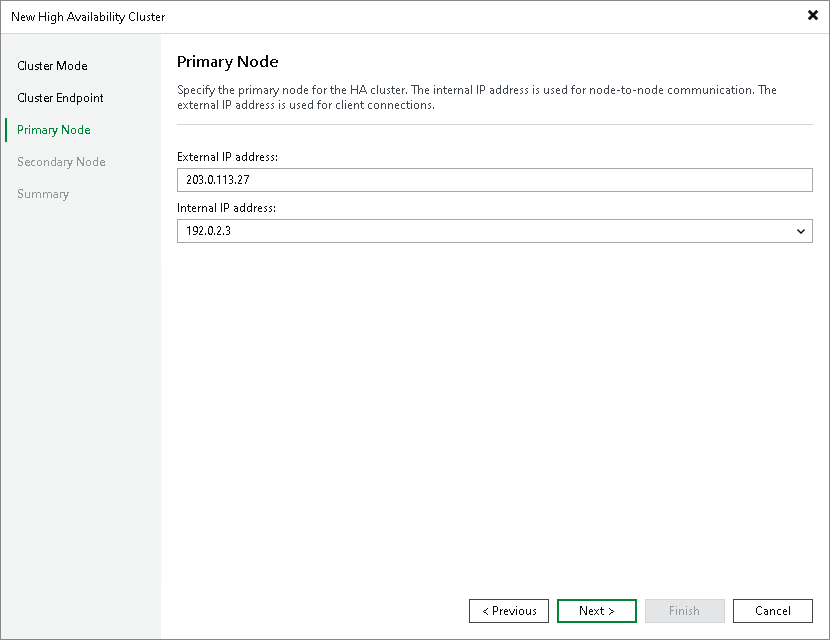

# Step 4b. Specify Primary Node Settings

At the Primary Node step of the wizard, specify the IP addresses for the primary node.

1. In the External IP address field, specify the external IP address of the primary node.
2. From the Internal IP address drop-down list, select the internal IP address of the primary node. Veeam Backup & Replication uses this IP address for node-to-node communication with the secondary node.

|  |
| --- |
| Note |
| Register the external IP address of the primary node in DNS as an A/AAAA record pointing to the cluster hostname you specified at [Step 3](cross_subnet_endpoint.md). The HA cluster manages the assignment of the external IP address to the network interface — do not configure this address as a static address directly on the primary node. |

Page updated 2026-07-17

