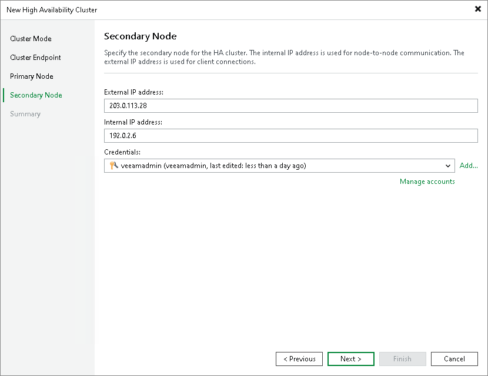

# Step 4c. Specify Secondary Node Settings

At the Secondary Node step of the wizard, specify the IP addresses and credentials for the secondary node.

1. In the External IP address field, specify the external IP address of the secondary node.
2. In the Internal IP address field, specify the internal IP address of the secondary node. Veeam Backup & Replication uses this IP address for node-to-node communication with the primary node.
3. From the Credentials drop-down list, select credentials for the administrator account on the secondary node. If you have not set up credentials beforehand, click Add or the Manage accounts link. For more information, see [Credentials Manager](credentials_manager.md).

|  |
| --- |
| Note |
| Register the external IP address of the secondary node in DNS as an A/AAAA record pointing to the cluster hostname you specified at [Step 3](cross_subnet_endpoint.md). The configuration database on the secondary node will be overwritten during cluster initialization. While the secondary node is in standby, its external IP rejects connections on port 443 — this is expected behavior. After a switchover or failover, the node roles swap automatically. |

Page updated 2026-07-17

