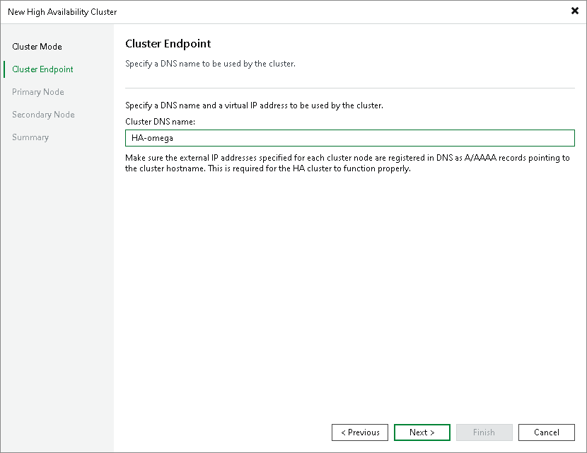

# Step 3b. Specify Cross-Subnet Cluster Endpoint Settings

At the Cluster Endpoint step of the wizard, specify the DNS name for the HA cluster.

In the Cluster DNS name field, specify the DNS name of the HA cluster. Veeam Backup & Replication uses this DNS name to connect to the HA cluster.

|  |
| --- |
| Important |
| You cannot specify the virtual IP address for the cluster endpoint. |

|  |
| --- |
| Note |
| If Veeam Backup & Replication detects that the backup server is already managed by Enterprise Manager, it displays a prompt asking whether to open the Enterprise Manager web UI so you can re-add the backup server using the cluster DNS name after you assemble the cluster. |

Page updated 2026-07-10

