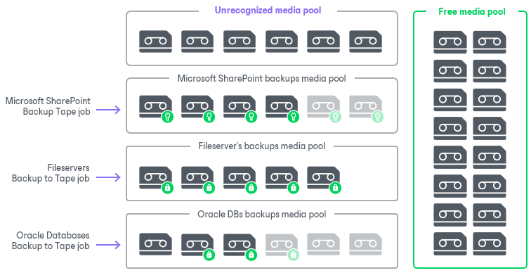

# Media Pools

In this article

Media pools are target destinations for backup to tape and file to tape jobs. The media pools manage empty (or available for overwriting) tapes to allow the tape jobs write data. You can create as many media pools as you need. One media pool can be target for unlimited number of tape jobs. The GFS jobs require GFS media pools. For more information, see [GFS Media Pools](gfs_media_pools.md).

Tapes for Media Pools

For writing data, you can use rewritable tapes or WORM (Write Once Read Many) tapes. For more information, see [WORM Tapes](worm_tapes.md). For using WORM tapes, you need to create separate media pools. The following types of media pools are available:

* Media pools
* WORM media pools

For more information on creating WORM media pools, see [Creating Media Pools](creating_custom_media_pools.md).

Media Pools Configuration

For each media pool, you can configure rules. Such rules are further applied to every tape that belongs to this media pool.

You can apply the following rules:

* Add tape libraries: select and manage tape libraries that will be used by the media pool.
* Configure tape replenishment: you can allocate some particular tapes or let the media pool take a free tape when required.
* Create media sets: media sets allow you to create sets of tapes with data for a particular time period.
* Set the data retention period: this setting lets you choose the period for which the data on tapes will be protected from overwriting (not applicable for WORM tapes).
* Enable parallel processing: you can allow the media pool to use multiple tape drives simultaneously for writing data to tape. With parallel processing enabled, the media pool can process simultaneously several tape jobs or split the data within one tape job across tape drives.
* Encrypt the data written to tapes.
* Export tapes to vault.

A tape allocated to a media pool will always be tied to its media pool. When you bring a tape with expired data online, Veeam Backup & Replication places it automatically to the media pool where the tape was written.

Related Topics

* [Creating Media Pools](creating_custom_media_pools.md)
* [Moving Tapes to Another Media Pool](moving_tapes_to_custom_pool.md)
* [Modifying Media Pools](modifying_media_pools.md)
* [Removing Media Pools](deleting_media_pools.md)

Page updated 6/21/2023

Page content applies to build 13.0.1.1071
