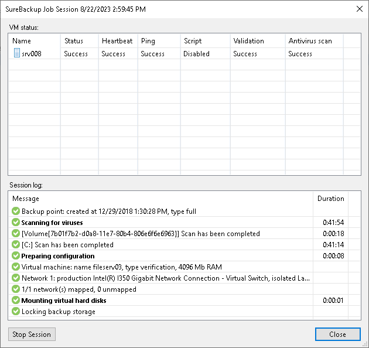

# Custom Verification Scripts

In this article

Veeam Backup & Replication can verify VMs with the following custom verification scripts:

* [Microsoft SQL Server Checker script](#sql)
* [Backup file validation](#validation)

|  |
| --- |
| Important |
| Consider the following:   * Do not pass sensitive information using script arguments in a user interface. * If you use the Microsoft SQL Server authentication mode, you may need to specify credentials of the account to connect to the machine on which Microsoft SQL Server is installed. To do this, use the Credentials tab in the application group or SureBackup job settings. * You can not use domain credentials for the script execution if you have Veeam Backup & Replication deployed in Microsoft Azure and it is managed by Microsoft Intune. Use local credentials for Microsoft SQL Server instead. * During the major version upgrade procedure (for example, from version 11 to version 12), Veeam Backup & Replication may replace the SQL checker script with the default one. If you have manually modified the SQL checker script before upgrading to a new version, reapply those modifications after the update. |

Microsoft SQL Server Checker Script

If you need to verify a virtualized Microsoft SQL Server, you can instruct Veeam Backup & Replication to run the Microsoft SQL Server Checker script against it during the SureBackup job. The script sequentially performs the following operations:

1. Connects to Microsoft SQL Server instances.
2. Enumerates databases on these instances.
3. Employs the USE SQL statement to connect to databases and check their availability.

The script is located on the backup server in the Veeam Backup & Replication product folder. The path by default: C:\Program Files\Veeam\Backup and Replication\Backup\Veeam.Backup.SqlChecker.vbs.

Credentials for Script Execution

To execute the script, Veeam Backup & Replication connects to Microsoft SQL Server. By default, Veeam Backup & Replication uses the account under which the Veeam Backup Service is running. If you need to run the script under another account, you can specify credentials for this account. The script supports the following authentication methods:

* Microsoft Windows authentication mode. To use it, you must specify credentials for the account on the Credentials tab in the application group or SureBackup job settings.
* SQL Server authentication mode. To use it, you must pass credentials of the account to the script. You can pass credentials the following ways:

* By running the Microsoft SQL Server Checker Script from the PowerShell. To do it, use the following command in the PowerShell console:

|  |
| --- |
| cscript C:\Program Files\Veeam\Backup and Replication\Backup\Veeam.Backup.SqlChecker.vbs <sql server[\instance]> <username> <password> |

You can find the results of a script execution in the log file by the following path: %programdata%\Veeam\Backup\<name of the job>\<VM name>\_SQLChecker.log. If necessary, you can change the log file location. To do this, specify a new path in the PowerShell command:

|  |
| --- |
| cscript C:\Program Files\Veeam\Backup and Replication\Backup\Veeam.Backup.SqlChecker.vbs [C:\Logs] <sql server[\instance]> <username> <password> |

* By modifying credentials in the Veeam.Backup.SqlChecker.vbs file. The script is located on the backup server in the Veeam Backup & Replication product folder. The default path: C:\Program Files\Veeam\Backup and Replication\Backup\Veeam.Backup.SqlChecker.vbs.

Database Exclusion

By default, Veeam Backup & Replication verifies all databases on all instances of Microsoft SQL Server. However, you can exclude specific databases from verification. For example, vCenter Server database. To exclude an instance or a database, you must open the script in the text editor and edit the Settings section in the following way:

* To exclude a specific databases, uncomment the gDBsToExclude.Push "dbname" line in the script and specify the names of a database that you want to exclude. To exclude several databases, specify a separate line for each database.

|  |
| --- |
| gDBsToExclude.Push "dbname1"  gDBsToExclude.Push "dbname2" |

* To exclude a specific instance, uncomment the gInstancesToExclude.Push "instancename" line in the script and specify the name of an instance that you want to exclude. To exclude several instances, specify a separate line for each instance.

|  |
| --- |
| gInstancesToExclude.Push "instancename1"  gInstancesToExclude.Push "instancename2" |

* To exclude the default instance, uncomment the gInstancesToExclude.Push "MSSQLSERVER" line.

|  |
| --- |
| Important |
| Instance and database names are case sensitive. |

Logging

To define whether the script has completed successfully or not, Veeam Backup & Replication publishes the following return codes in the SureBackup job session statistics:

* 0 — test is passed successfully.
* 1 — you use a wrong syntax for the script command.
* 2 — Veeam Backup & Replication is unable to connect to Microsoft SQL Server.
* 3 — all instances are excluded from the check.
* 4 — error occurred while Veeam Backup & Replication was getting the list of databases.
* 5 — unknown error.
* 6 — one or more databases are not accessible.

Results of script execution are written to the log file located by the following path: %programdata%\Veeam\Backup\<name of the job>\<VM name>\_SQLChecker.log. If necessary, you can change the log file location. To do this, pass a new path to the log file in the %log\_path% argument in the application group or SureBackup job settings.

Backup File Validation

In addition to recovery verification tests, Veeam Backup & Replication allows you to perform backup file validation. For backup file validation, Veeam Backup & Replication performs a CRC check for backup files of machines verified by the SureBackup job. You can also validate backup files for machines from the application group with this test.

To validate the backup file, Veeam Backup & Replication uses the checksum algorithm. When Veeam Backup & Replication creates a backup file for a machine, it calculates a checksum for every data block in the backup file and stores this data in the backup file, together with machine data. During the backup file validation test, Veeam Backup & Replication decompresses the backup file, recalculates checksums for data blocks in the decompressed backup file and compares them with initial checksum values. If the results match, the test is passed.

The backup file validation test is started after recovery verification tests. As soon as Veeam Backup & Replication completes all "live" verification for all machines in the SureBackup job, it unpublishes machines and starts the backup file validation test.

The result of the backup file validation test impacts the state of the SureBackup job session. If the verification tests are completed successfully but the backup validation is not passed, Veeam Backup & Replication marks the SureBackup job session with the Failed status.

Page updated 4/29/2025

Page content applies to build 13.0.1.1071
