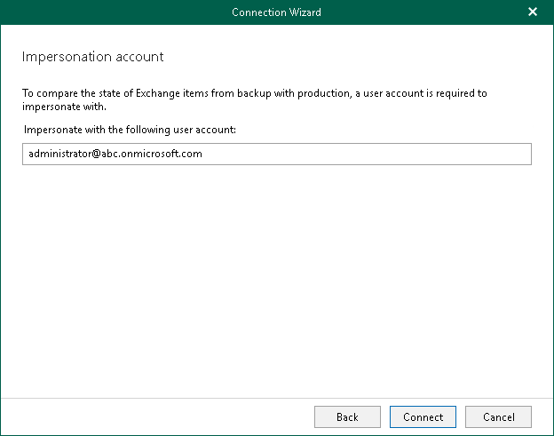

# Step 3. Specify Impersonation Account

This step is only available if you have selected the Modern Authentication (certificate-based) option at the [Select Authentication Method](vex_data_compare_credentials.md#certificate) step.

At this step of the wizard, specify a user account to impersonate with and click Connect.

