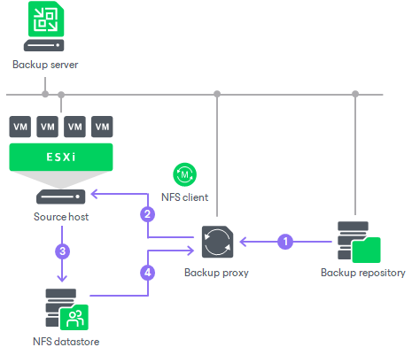

# Data Restore in Direct NFS Access Mode

In this article

The Direct NFS access transport mode can be used to restore VMs with thick and thin disks.

Data restore in the Direct NFS access transport mode is performed in the following way:

1. The VMware backup proxy retrieves data blocks from the backup repository or a datastore in the target site.
2. The VMware backup proxy sends a request to the ESXi host to restore data to an NFS datastore.
3. The ESXi host allocates space on the NFS datastore.
4. Data blocks obtained from the VMware backup proxy are written to the NFS datastore over LAN.

With the selected option Same as source from the [Restore disk type](disk_restore_map_vm.md) drop-down list, Veeam Backup & Replication restores the disk with the same type as in the backup. However, during the restore in the Direct NFS access mode, the disk type can be affected by settings specified for your NFS server, VAAI, and so on. Thin disks can be restored as thin disks, thick eager disks as thick eager disks. Thus, Veeam Backup & Replication converts thick lazy zeroed disks to thick eager disks, if you use VAAI, otherwise to thin disks. For more information about disk types, see [VMware Docs](https://techdocs.broadcom.com/us/en/vmware-cis/vsphere/vsphere/8-0/vsphere-single-host-management-vmware-host-client-8-0/virtual-machine-management-with-the-vsphere-host-client-vSphereSingleHostManagementVMwareHostClient/configuring-virtual-machines-in-the-vsphere-host-client-vSphereSingleHostManagementVMwareHostClient/virtual-disk-configuration-vSphereSingleHostManagementVMwareHostClient/about-virtual-disk-provisioning-policies-vSphereSingleHostManagementVMwareHostClient.html).

Page updated 2/6/2025

Page content applies to build 13.0.1.1071
