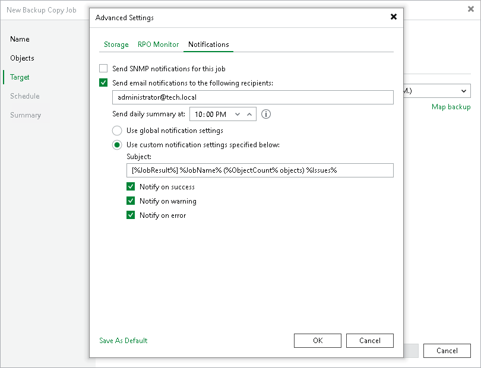

# Notification Settings

At the Notifications tab, to specify notification settings for the backup copy job:

1. At the Target step of the wizard, click Advanced.
2. Click the Notifications tab.
3. Select the Send SNMP notifications for this job check box if you want to receive SNMP traps when the job completes successfully. SNMP traps will be sent if you specify global SNMP settings in Veeam Backup & Replication and configure software on recipient's machine to receive SNMP traps. For more information, see [Specifying SNMP Settings](snmp_settings.md).
4. Select the Send email notifications to the following recipients check box if you want to receive notifications by email in case of job failure or success. In the field below, specify a recipient email address. You can enter several addresses separated by a semicolon.
5. Veeam Backup & Replication sends a consolidated email notification once for the specified backup copy interval. Even if the synchronization process is started several times within the interval, for example, due to job retries, only one email notification will be sent.
6. Email notifications will be sent if you configure global email notification settings in Veeam Backup & Replication. For more information, see [Configuring Global Email Notification Settings](general_email_notifications.md).
7. At the Send at field, specify the time when you want to receive notifications. Note that you will receive a notification on the job status once a day.
8. You can choose to use global notification settings or specify custom notification settings.

* To receive a typical notification for the job, select Use global notification settings. In this case, Veeam Backup & Replication will apply to the job global email notification settings specified for the backup server. For more information, see [Configuring Global Email Notification Settings](general_email_notifications.md).
* To configure a custom notification for a job, select Use custom notification settings specified below. You can specify the following notification settings:

1. In the Subject field, specify a notification subject. You can use the following variables in the subject: %Time% (completion time), %JobName%, %JobResult%, %VmCount% (number of machines in the job) and %Issues% (number of machines in the job that have been processed with the Warning or Failed status).
2. Select the Notify on success, Notify on warning and Notify on error check boxes to receive email notification if data processing within the backup copy interval completes successfully, fails or completes with a warning.

