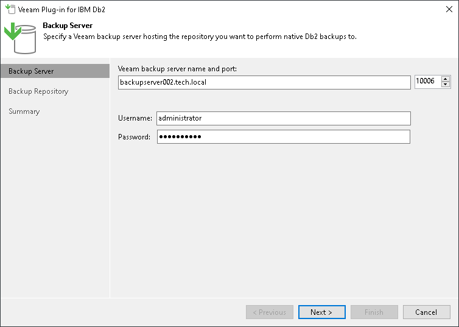
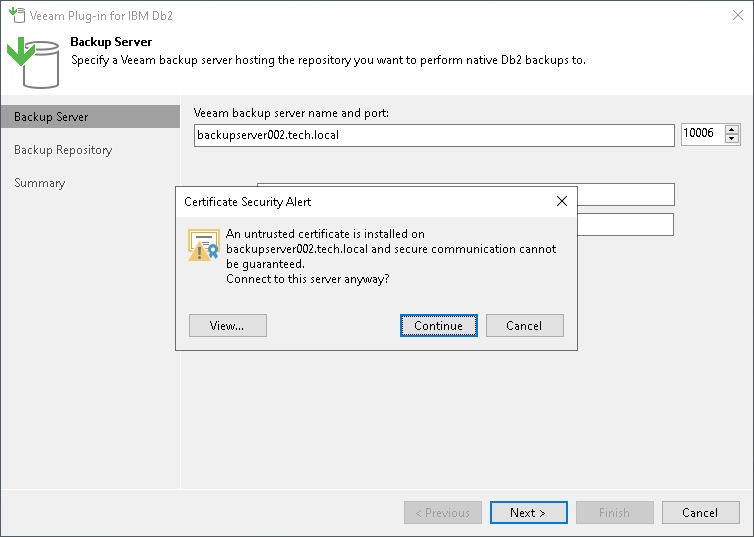
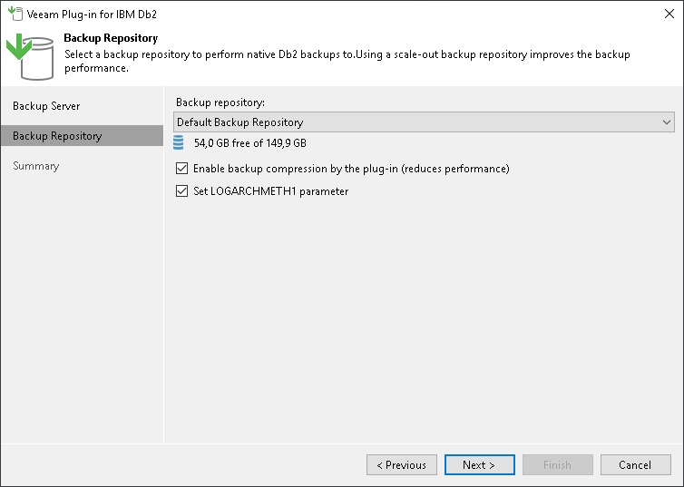
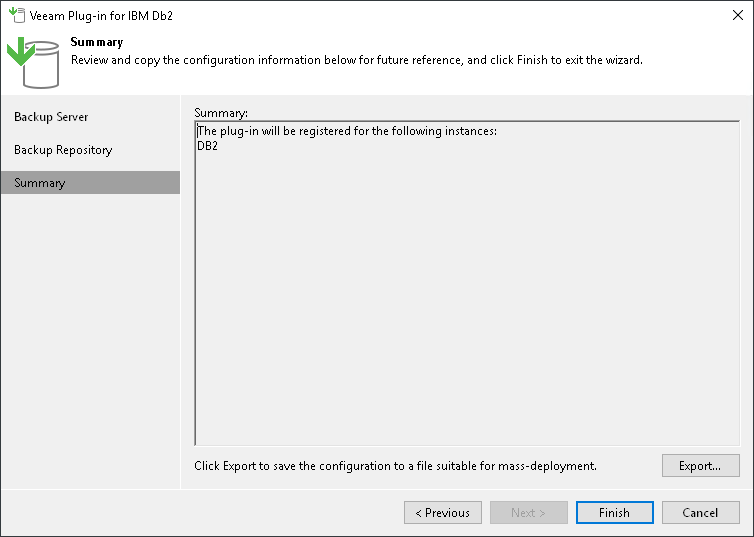

# Configuring Plug-In on Microsoft Windows

To configure backup, restore and authentication settings, use the Veeam Plug-In for IBM Db2 configuration wizard. The wizard configures database settings and creates the Veeam Plug-In configuration file (veeam\_config.xml) which is stored in the %PROGRAMFILES%\Veeam\VeeamPluginforDB2 folder on the machine where Veeam Plug-In is installed.

To configure Veeam Plug-In, do the following:

1. Log in to the IBM Db2 server with an account which is a member of the local Administrators group or the instance owner of the IBM Db2 instance.
2. On the IBM Db2 server, launch the Veeam Plug-In for IBM Db2 Configuration Wizard (%PROGRAMFILES%\Veeam\VeeamPluginforDB2\Veeam.Backup.DB2.Configuration.exe).
3. At the Backup Server step of the wizard, specify the DNS name of the Veeam Backup & Replication server and OS user account credentials that will be used to connect to the server.

1. If you connect to the specified Veeam Backup & Replication server for the first time, Veeam Plug-In displays the Certificate Security Alert window. After you review the certificate, click Continue to confirm the connection.

1. At the Backup Repository step of the wizard:

1. From the Backup repository list, select the backup repository where you want to store backups.

You must allow access to Veeam backup repositories that you plan to use. To learn how to configure access permissions on repositories, see [Access and Encryption Settings on Backup Repositories](db2_repository_permissions.md).

1. If you want to enable Veeam Plug-In compression, select the Enable backup compression by the plug-in check box. Veeam Plug-In will use the built-in compression functionality of Veeam Backup & Replication to compress database backups before transferring them to the backup repository. Compression reduces the size of transferred data but increases the load on the IBM Db2 server, which can reduce the backup performance.

1. If you want Veeam Plug-In to switch the database to archive logging with the logarchmeth1 configuration parameter, select the Set LOGARCHMETH1 parameter check box.

Archive logs contain all transactional changes and enable point-in-time restores. After the wizard sets the logarchmeth1 parameter and you perform a backup, Veeam Plug-In automatically processes and transfers archived logs to the selected backup repository.

Keep in mind that you must set Veeam Plug-In to use the logarchmeth1 parameter to back up IBM Db2 databases online. Otherwise, you can back up databases only offline. For details, see [Log Backup](plugins_db2_backup_types_log_backup.md) and [this IBM article](https://www.ibm.com/docs/en/db2/11.5?topic=parameters-logarchmeth1-primary-log-archive-method).

1. Click Next.

|  |
| --- |
| Important |
| You can work with backups created by Veeam Plug-In only with the account used for creating the backups. If you want to use another account, assign the Backup Administrator role or Backup Operator and Restore Operator roles to the account.  For details on how to assign Veeam Backup & Replication roles, see [Managing Users and Roles](users_roles.md). |

1. At the Summary step of the wizard, review the configuration information.

1. To export the plug-in configuration file (veeam\_config.xml), click Export. You can use the exported file to apply the plug-in settings on other servers. For details, see [Exporting and Importing Plug-In Settings](db2_import_export_settings.md).
2. Click Finish.

If you selected the Set LOGARCHMETH1 parameter check box and the Veeam Plug-In configuration is completed successfully, the database switches to the BACKUP PENDING state. Before you can activate the database, you must perform a full offline backup. To learn more, see [Performing Full Backup](db2_protection_full.md).

Page updated 2026-07-10

