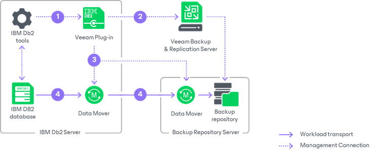

# How Veeam Plug-In for IBM Db2 Works

Veeam Plug-In acts as an agent between an IBM Db2 server and Veeam backup repositories.

Veeam Plug-In compresses database backups and transfers them to a backup repository connected to the Veeam Backup & Replication infrastructure. After you install and configure Veeam Plug-In on the IBM Db2 server, you can perform all backup and restore operations with scripts and with IBM Db2 tools, such as native IBM Db2 Call Level Interface (CLI).

When Veeam Plug-In is configured, IBM Db2 tools perform a database backup in the following way:

1. When you start a database backup, IBM Db2 loads the configuration provided by Veeam Plug-In. This configuration is stored in the Veeam Plug-In configuration file (veeam\_config.xml) that is located in the /opt/veeam/VeeamPluginforDB2 directory on the machine where Veeam Plug-In is installed.
2. Veeam Plug-In connects to the backup server specified in the configuration file and creates a backup job. In the Veeam Backup & Replication console, Veeam backup administrators can use the backup job to monitor IBM Db2 backups. Keep in mind that all backup jobs that you run on your machine with Veeam Plug-In are displayed as 1 backup job in the Veeam Backup & Replication console.
3. Veeam Plug-In starts Veeam Data Mover services on the IBM Db2 server and on a backup repository.
4. Veeam Data Movers transport data to the backup repository.

