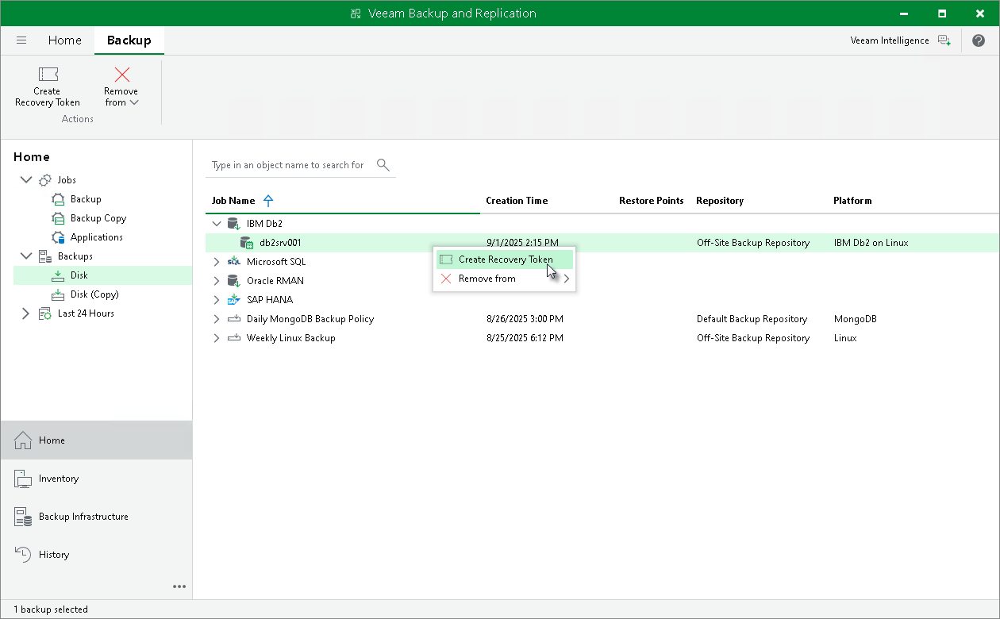
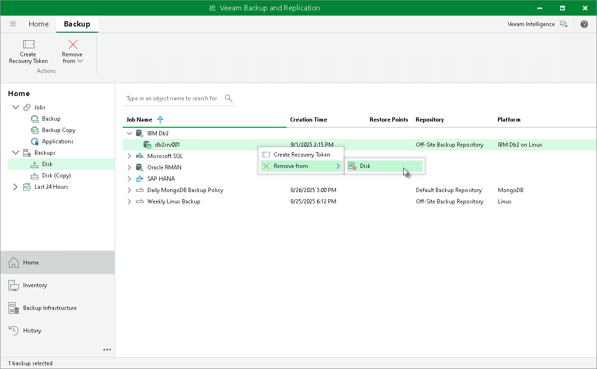
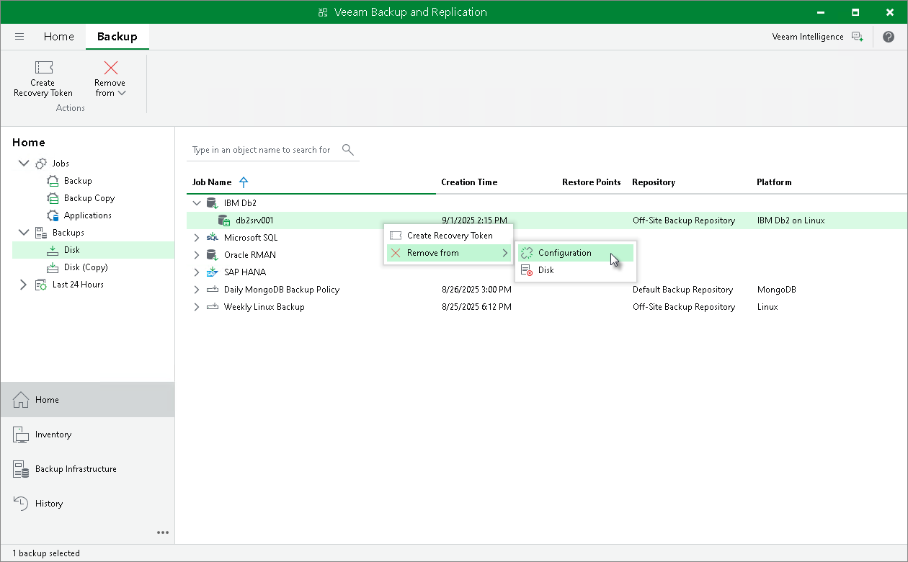
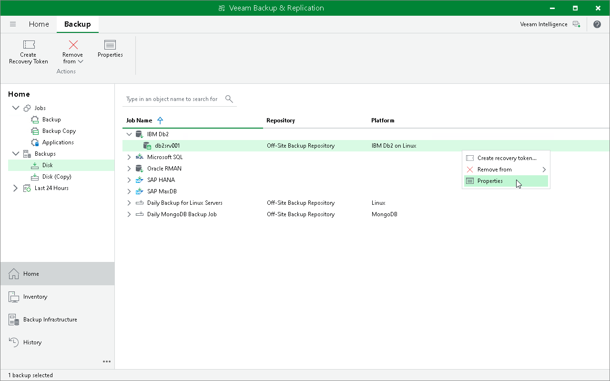

# Managing Backups in Veeam Backup & Replication

In the Veeam Backup & Replication console, backups created by Veeam Plug-Ins are displayed in the Backups node of the Home view. In the working area, backups created by Veeam Plug-In for IBM Db2 are listed under the IBM Db2 node.

You can use the Veeam Backup & Replication console to create recovery token, delete the backup, and view the backup properties.

Creating Recovery Token

If you want to recover database data from a specific backup, you can use the Create recovery token operation.

You can generate the recovery token on the Veeam Backup & Replication side. Then, on the computer side, with this recovery token get access to the backup and recover data that are stored in the backup. To learn more about operations on the computer side, see [Restore to Another Server Using Recovery Token](db2_restore_to_another_token.md).

Before creating a recovery token, consider the following prerequisites and limitations:

* Recovery tokens stay valid for 24 hours.
* You can recover data only from the backup for which the recovery token is generated.
* During recovery, Veeam Backup & Replication does not stop backup operations.
* You cannot create a recovery token for a whole backup copy job, but you can create a recovery token for individual objects included in a backup copy job.

To create a recovery token on the Veeam Backup & Replication side:

1. Open the Home view.
2. In the inventory pane, click Backups.
3. In the working area, right-click the backup and select Create Recovery Token.

You can create a recovery token for several backups. To do this, press and hold [Ctrl], select multiple backups, right-click one of the selected backups and select Create Recovery Token.

1. In the Create Recovery Token window, click Create.

You can also create and modify the existing recovery token using the PowerShell console. To learn more, see the [Working with Tokens](https://helpcenter.veeam.com/docs/vbr/powershell/tokens.html?ver=13) section in the Veeam PowerShell Reference.

|  |
| --- |
| Tip |
| Alternatively, you can get access to the backup using user credentials. |

Deleting Backups Manually

You can use the Veeam Backup & Replication console to delete backups created with Veeam Plug-In from a Veeam backup repository.

To delete a backup, do the following:

1. In the Veeam Backup & Replication console, open the Home view.
2. In the inventory pane, select Backups.
3. In the working area, right-click the name of the backed-up object and select Delete from > Disk.

Removing Backups from Configuration

If you want to remove records about backups from the Veeam Backup & Replication console and configuration database, you can use the Remove from configuration operation. When you remove a backup from configuration, backup files (.VAB, .VASM, .VACM) remain in the backup repository. You can import the backup later and restore data from it.

To remove a backup from configuration:

1. Open the Home view.
2. In the inventory pane, select Backups.
3. In the working area, select the necessary backup.
4. Press and hold the [Ctrl] key, right-click the backup and select Remove from > Configuration.

Viewing Backup Properties

To review what data Veeam Plug-In has backed up, check the backup properties in the Veeam Backup & Replication console.

To view backup properties:

1. Open the Home view.
2. In the inventory pane, expand the Backups node and select Disk. To view properties of backups stored on tape, select Tape.
3. In the working area, right-click the backup and select Properties.

The backup properties window displays the following information about the content of a backup file:

* Objects — databases backed up by Veeam Plug-In.
* Files — backup files of a selected database that are stored in the backup repository.

To find a specific item in a list, use the search field. To copy the path to a backup file, use the Copy path button.

Page updated 2026-07-29

