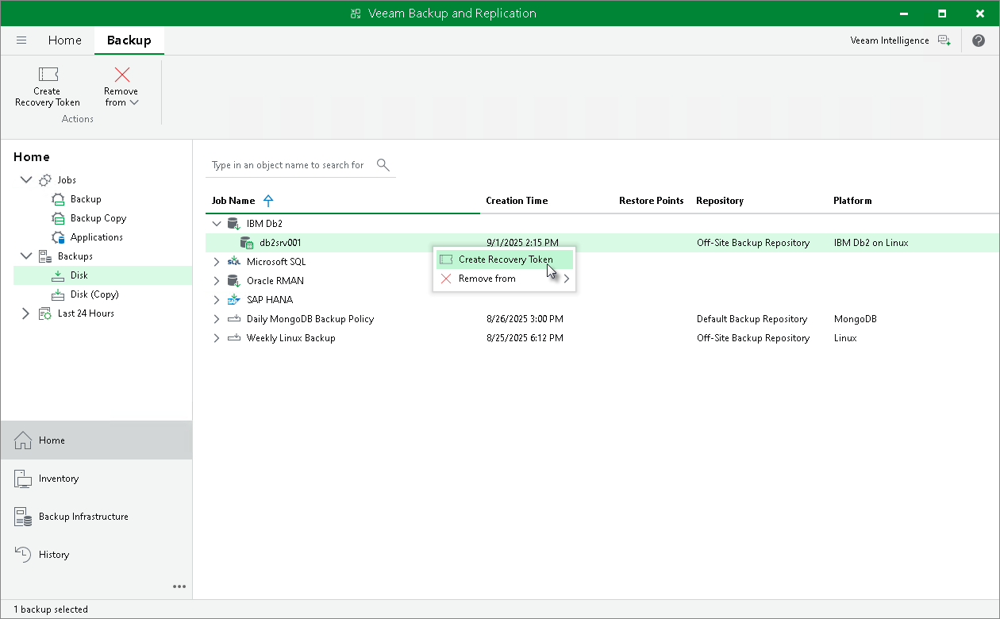

# Creating Recovery Token

In this article

If you want to recover database data from a specific backup, you can use the Create recovery token operation.

You can generate the recovery token on the Veeam Backup & Replication side. Then, on the computer side, with this recovery token get access to the backup and recover data that are stored in the backup.

Limitations

Before creating a recovery token, consider the following prerequisites and limitations:

* Recovery tokens stay valid for 24 hours.
* You can recover data only from the backup for that the recovery token is generated.
* During recovery, Veeam Backup & Replication does not stop backup operations.
* You cannot create a recovery token for a whole backup copy job, but you can create a recovery token for individual objects included in a backup copy job.

Generating Recovery Token

To create a recovery token on the Veeam Backup & Replication side:

1. Open the Home view.
2. In the inventory pane, click Backups.
3. In the working area, right-click the backup and select Create Recovery Token.

You can create a recovery token for several backups. To do this, press and hold [Ctrl], select multiple backups, right-click one of the selected backups and select Create Recovery Token.

1. In the Create Recovery Token window, click Create.

You can also create and modify the existing recovery token using the PowerShell console. To learn more, see the [Working with Tokens](https://helpcenter.veeam.com/docs/vbr/powershell/tokens.html?ver=13) section in the Veeam PowerShell Reference.

|  |
| --- |
| Tip |
| Alternatively, you can get access to the backup using user credentials. |

Page updated 9/2/2025

Page content applies to build 13.0.1.1071
