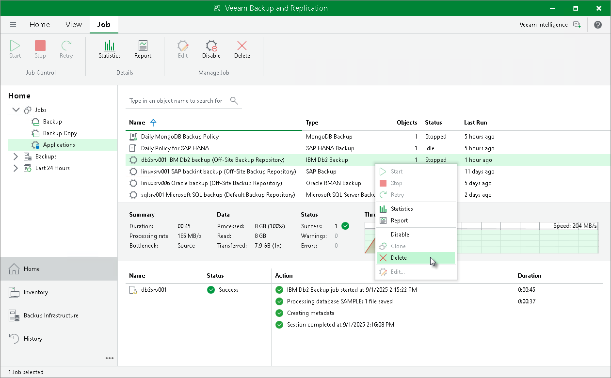

# Deleting Backup Job

You can delete Veeam Plug-In backup jobs in the Veeam Backup & Replication console. When you delete a job, Veeam Backup & Replication removes all records about the job from its database and console. Veeam Plug-In backups created by this job remain intact on the backup repository. In the Veeam Backup & Replication console, such backups are displayed in the Home view, under the Backups > Disk (Orphaned) node in the inventory pane. In certain cases, the backups can be displayed in other nodes:

* In case of capacity tier, the backups are displayed under the Backups > Capacity Tier (Orphaned) node in the inventory pane.
* In case of object storage, the backups are displayed under the Backups > Object Storage (Orphaned) node in the inventory pane.

Note that if the user starts a new backup job session from the machine with Veeam Plug-In, the job will appear in the Veeam Backup & Replication console again, and records about a new job session will be stored in the Veeam Backup & Replication database.

To delete a backup job, do the following:

1. Open the Veeam Backup & Replication console.

1. In the Home view, expand the Jobs node in the inventory pane and click Applications Plug-ins.

1. In the working area, select the necessary job and click Delete on the ribbon. You can also right-click the job and select Delete.

